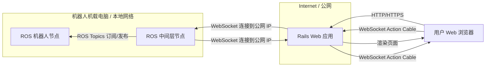
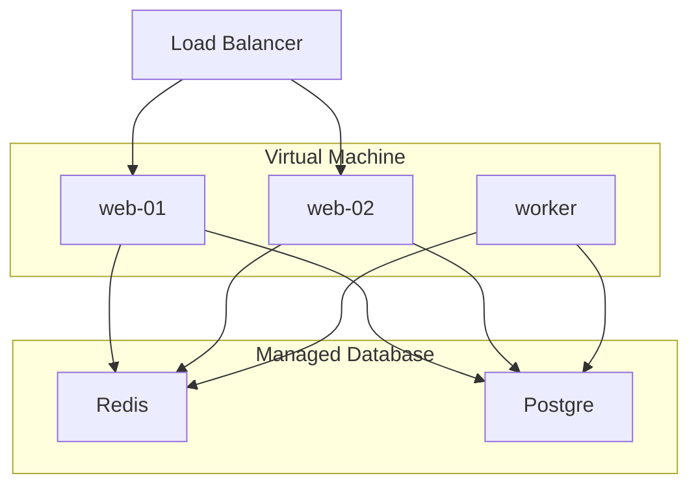

# frontend

## 项目概述

- 目标：本项目是一个使用 Ruby on Rails 构建的 Web 应用，作为控制 ROS Noetic 机器人的前端界面，（预计）通过 WebSocket 与机器人通信，旨在提供一个用户友好的界面来展示机器人的状态和控制机器人

- 技术栈：Rails 7.2.2.1、Tailwind CSS、Action Cable、WebSocket

- 开发环境：WSL2 Ubuntu 22.04

## 开发计划

- 部署策略：先于本地开发，后期基于 Kamal + Docker 部署至云服务器

- 数据库：本地开发使用 SQLite，（预计）后期部署使用 PostgreSQL + Redis

## 机器人控制系统架构与开发计划

为了实现 Rails Web 应用与 ROS 机器人的交互，我们将构建一个包含多个组件的分布式系统。核心思想是通过一个中间层（位于 ROS 端）将 ROS 的消息机制与 Web 的 WebSocket 机制连接起来。

**阶段 2: ROS 中间层开发**

1. **选择开发语言和 WebSocket 库:**
    - Python 是 ROS 中常用的语言，有成熟的 WebSocket 客户端库 (如 `websocket-client`)。
    - C++ 也可以，但 WebSocket 客户端库可能需要额外安装或集成。
    - 选择 Python 和 `websocket-client` 是一个不错的起点。
2. **创建 ROS 节点:**
    - 使用 `rospy` (Python) 创建一个新的 ROS 节点。
3. **实现 WebSocket 客户端:**
    - 在 ROS 节点中集成 `websocket-client` 库。
    - 编写代码连接到您的 Rails 应用的 Action Cable WebSocket URL (例如 `ws://164.92.93.178/cable` 或 `wss://164.92.93.178/cable` 如果使用 SSL)。
    - 实现 WebSocket 连接的事件处理函数 (`on_open`, `on_message`, `on_error`, `on_close`)。
    - 在 `on_open` 中，发送 Action Cable 订阅消息到 `RobotStatusChannel` 和 `RobotControlChannel`。
    - 在 `on_message` 中，解析从 Rails 接收到的消息（命令），并根据命令内容发布到相应的 ROS Topics。
4. **实现 ROS Topics 订阅与发布:**
    - 订阅您需要获取数据的 ROS Topics (例如 `/robot/status`, `/sensor/data`)。
    - 编写回调函数，当收到新的 ROS Topic 数据时，将数据格式化为 JSON 或其他适合通过 WebSocket 传输的格式。
    - 通过 WebSocket 连接将格式化后的数据发送给 Rails 应用。
    - 根据从 WebSocket 接收到的命令，发布消息到相应的 ROS Topics (例如 `/robot/cmd_vel`, `/robot/command`)。

**阶段 3: 集成与测试**

1. **连接 ROS 中间层与 Rails 后端:**
    - 修改 Rails 后端 `RobotControlChannel` 的逻辑，将接收到的 Web 客户端命令通过某种方式发送给连接的 ROS 中间层 WebSocket 客户端。这可能需要在 Rails 后端维护与 ROS 中间层连接的 WebSocket 实例引用。
    - 修改 Rails 后端 `RobotStatusChannel` 的逻辑，接收从 ROS 中间层 WebSocket 客户端发送过来的数据。
    - **重要考虑:** Action Cable 的设计是服务器广播给多个客户端。ROS 中间层作为单个客户端连接到 Rails。您需要确保 Rails 能识别这个特殊的客户端（ROS 中间层），并将发给 ROS 的命令只发送给它，而不是广播给所有 Web 客户端。一种方法是 ROS 中间层连接时携带某种身份标识，或者使用单独的 Channel 专门用于 Rails <-> ROS 中间层通信。
2. **端到端测试:**
    - 部署 Rails 应用到服务器。
    - 在机器人机载电脑上运行 ROS 中间层节点。
    - 在 Web 浏览器中访问 Rails 应用。
    - 测试 ROS 数据是否能实时显示在 Web 页面上。
    - 测试通过 Web 页面发送的命令是否能正确控制机器人。
3. **错误处理与鲁棒性:**
    - 实现 WebSocket 连接断开后的自动重连机制（Rails 端和 ROS 中间层端）。
    - 处理数据格式错误、无效命令等异常情况。
    - 在各组件中添加详细的日志记录，便于调试。
4. **安全性增强:**
    - 为您的 Rails 应用配置 SSL/TLS，使用 `wss://` 连接，保护 WebSocket 数据传输。
    - 实现 ROS 中间层连接到 Rails 的身份验证机制（例如，通过 WebSocket 发送一个 Token 进行验证）。
    - 在 Rails 后端对接收到的命令进行严格的验证和过滤，防止恶意命令。
5. **性能优化:**
    - 根据传输数据的频率和大小，优化数据格式和传输效率。
    - 监控服务器和机器人机载电脑的资源使用情况。

**阶段 4: 部署与维护**

1. **生产环境部署:**
    - 使用 Kamal 将 Rails 应用（包括 Action Cable 进程）部署到 DigitalOcean 服务器。确保 Kamal 配置中包含了 Action Cable 相关的服务和端口映射。
    - 配置服务器的防火墙，允许 WebSocket 端口的流量。
    - 在机器人机载电脑上设置 ROS 中间层节点的自启动。
2. **监控与维护:**
    - 设置应用监控，跟踪 Rails 应用、Action Cable、Redis 和 ROS 中间层节点的运行状态。
    - 定期更新依赖库和系统。

这个计划提供了一个结构化的方法来实现您的目标。关键在于 ROS 中间层作为连接 ROS 世界和 Web 世界的翻译官和桥梁。
