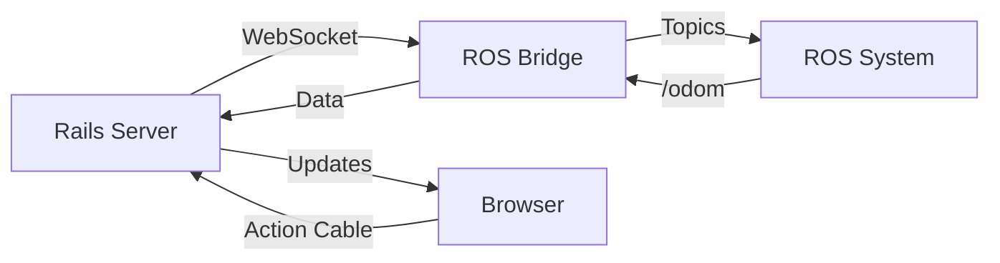

# frontend

## 项目概述

- 目标：本项目是一个使用 Ruby on Rails 构建的 Web 应用，作为控制 ROS Noetic 机器人的前端界面，（预计）通过 ROS Bridge 与机器人通信，旨在提供一个用户友好的界面来展示机器人的状态和控制机器人

- 技术栈：Rails 7.2.2.1、Tailwind CSS、ROS Bridge

- 开发环境：WSL2 Ubuntu 22.04

## 开发计划

- 部署策略：先于本地开发，后期基于 MRSK + Docker 部署至云服务器

- 数据库：本地开发使用 SQLite，（预计）后期部署使用 PostgreSQL + Redis

