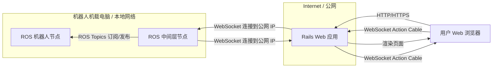
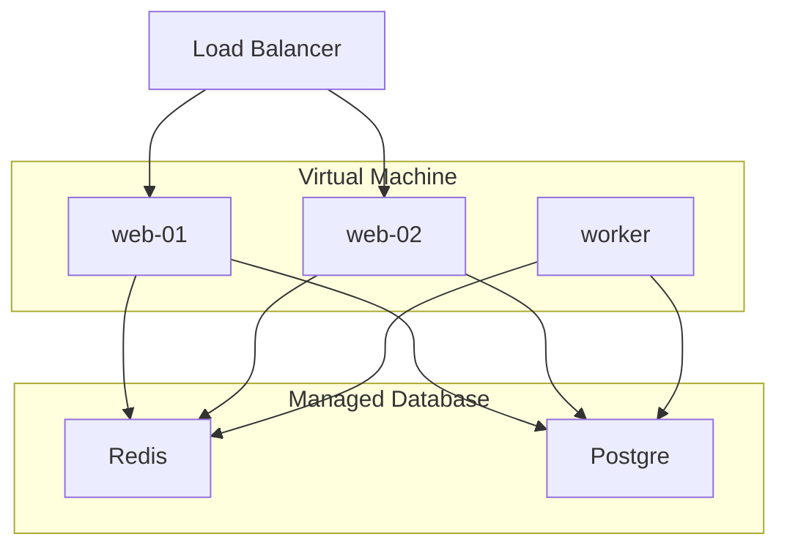

# frontend

## 项目概述

- 目标：本项目是一个使用 Ruby on Rails 构建的 Web 应用，作为控制 ROS Noetic 机器人的前端界面，（预计）通过 WebSocket 与机器人通信，旨在提供一个用户友好的界面来展示机器人的状态和控制机器人

- 技术栈：Rails 7.2.2.1、Tailwind CSS、Action Cable、WebSocket

- 开发环境：WSL2 Ubuntu 22.04




## 开发计划

- 部署策略：先于本地开发，后期基于 Kamal + Docker 部署至云服务器

- 数据库：本地开发使用 SQLite，（预计）后期部署使用 PostgreSQL + Redis



>目前部署策略仍在考虑尝试中，可能会有所调整。

## 运行

### 使用 Docker (推荐开发)

**前提条件:**

*   已安装 [Docker](https://www.docker.com/)
*   已安装 [Docker Compose](https://docs.docker.com/compose/install/)

**步骤:**

1.  **克隆仓库:**
    ```bash
    git clone <仓库地址>
    cd <项目目录>
    ```

2.  **构建 Docker 镜像:**
    此步骤会根据 `Dockerfile` 和 `docker-compose.yml` 构建应用程序和依赖项的镜像。首次构建可能需要一些时间。
    ```bash
    docker compose build
    ```

3.  **启动服务:**
    此命令将启动 Rails web 服务、可能的 worker 服务以及 Redis（根据 `docker-compose.yml` 的配置）。
    ```bash
    docker compose up
    ```

4.  **访问应用:**
    服务启动后，在浏览器中访问 `http://localhost:3000` 即可看到应用程序界面。

5.  **停止服务:**
    在运行 `docker compose up` 的终端中按 `Ctrl+C` 即可停止所有服务。


### (可选) 直接运行 (不推荐)

如果你选择不使用 Docker，并希望直接在本地运行此项目，你需要确保你的本地开发环境与项目所需的依赖项完全一致。以下是大致步骤：

**前提条件:**

*   **Ruby:** 版本 `3.3.4` (建议使用版本管理器如 `rbenv` 或 `rvm`)
*   **Node.js:** 一个较新的 LTS 版本 (例如 v18 或 v20+)
*   **Bundler:** RubyGems 包管理器 (`gem install bundler`)
*   **Redis:** 本地运行的 Redis 服务 (用于 Action Cable 和缓存)。
*   **系统依赖:** 需要安装一系列开发库。在 Ubuntu/Debian 系统上，可以尝试安装：
    ```bash
    sudo apt-get update && sudo apt-get install -y \
      build-essential git curl libjemalloc-dev libvips-dev \
      libsqlite3-dev sqlite3 postgresql-client libpq-dev nodejs watchman
    ```
    (注意：`libvips-dev` 可能需要额外的配置或来自其他源。不同操作系统包名可能不同。)

**步骤:**

1.  **克隆仓库:**
    ```bash
    git clone <仓库地址>
    cd <项目目录>
    ```

2.  **安装 Ruby 依赖:**
    ```bash
    bundle install
    ```

3.  **设置环境变量:**
    项目可能依赖环境变量。推荐使用 `dotenv-rails` gem (已包含在 `Gemfile` 中)。创建一个 `.env` 文件在项目根目录，并至少包含以下内容（根据需要调整）：
    ```dotenv
    # .env
    REDIS_URL=redis://localhost:6379/1
    # 如果需要连接 ROS 节点，确保设置 API Key
    ROBOT_API_KEY=<你的机器人API密钥>
    # 如果使用了加密的 credentials, 需要设置 RAILS_MASTER_KEY
    # RAILS_MASTER_KEY=<你的主密钥>
    ```
    *注意：*.env 文件应添加到 `.gitignore` 中，不应提交到版本库。

4.  **准备数据库:**
    对于开发环境（默认使用 SQLite），运行：
    ```bash
    bin/rails db:prepare
    ```

5.  **启动服务:**
    这将同时启动 Rails 服务器和 Tailwind CSS 监视进程。
    ```bash
    bin/dev
    ```

6.  **访问应用:**
    服务启动后，在浏览器中访问 `http://localhost:3000`。
    如果提示出错，可以尝试删除目录中的 `tmp/cache` 文件夹。

7.  **停止服务:**
    在运行 `bin/dev` 的终端中按 `Ctrl+C`。

**重要提示:**
*   直接在本地运行对环境配置要求较高，如果遇到依赖问题，调试过程可能比使用 Docker 更复杂。
*   上述系统依赖列表基于 `Dockerfile`，实际需要的包在不同系统上可能略有差异。
*   确保本地的 Redis 服务已启动。
