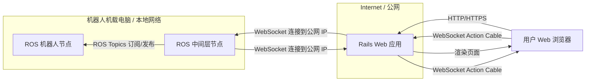
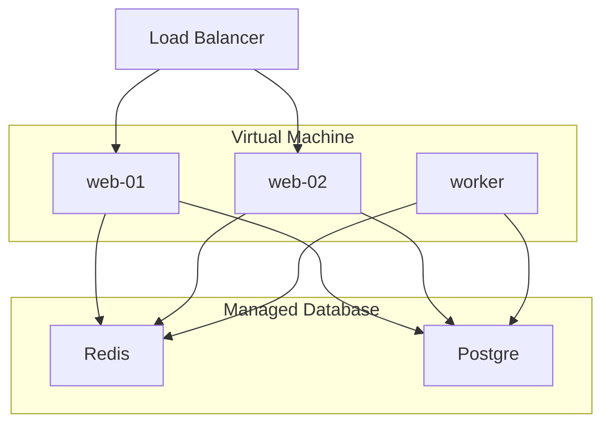

# frontend

## 项目概述

- 目标：本项目是一个使用 Ruby on Rails 构建的 Web 应用，作为控制 ROS Noetic 机器人的前端界面。旨在提供一个用户友好的界面来管理图书馆藏资源（书籍、书架、库位）、展示机器人状态，控制机器人执行导航建图、书籍取放、书架巡检等任务，并通过 WebSocket 与机器人进行实时通信。

- 技术栈：Rails 7.2.2.1、Tailwind CSS、Stimulus JS、Action Cable、WebSocket、PostgreSQL (生产环境)、SQLite (开发环境)

- 开发环境：WSL2 Ubuntu 22.04




## 开发计划

- 部署策略：先于本地开发，后期基于 Kamal + Docker 部署至云服务器

- 数据库：本地开发使用 SQLite，部署使用 PostgreSQL + Redis



## 功能模块

*   **核心通信与机器人控制:**
    
    *   [x] 通过 WebSocket (Action Cable) 实现 Web 前端 (JS) -> Rails Channels -> ROS `web_robot_bridge` -> ROS `task_manager` 的指令下发链路。
    *   [x] 通过 WebSocket (Action Cable) 实现 ROS `task_manager` -> ROS `web_robot_bridge` -> Rails `RobotFeedbackChannel` -> 前端 JS (DOM Events) 的反馈更新链路。
    *   [x] 前端界面 (通过 `RobotFeedbackInterface.js` 监听 `robot_status_model_update` 和 `robot_state_update` 事件) 实时展示机器人基本状态（来自 `RobotStatus` 模型的位置、速度、电量、连接状态、错误信息、当前任务、活动地图）。
    *   [x] 前端界面 (通过 `ManualControlController` 调用 `RobotControlChannel.js`) 提供基础移动控制按钮 (前进、后退、左转、右转、停止)。
    *   [x]  前端界面 (通过 `ManualControlController` 调用 `RobotControlChannel.js`) 提供紧急停止、从急停恢复、进入/退出手动控制模式的功能。
    *   [x] ROS `web_robot_bridge` 节点订阅 Rails `RosCommsSubscriberChannel`，接收任务和控制指令，并将其作为 `TaskDirective` ROS 消息发布。
    *   [x] ROS `web_robot_bridge` 节点订阅 `task_manager` 的 `TaskFeedback` 和 `RobotStatusCompressed` ROS 消息，并将数据转发给 Rails `RobotFeedbackChannel`。
    *   [x] ROS `task_manager` 节点维护机器人核心状态机，处理任务队列，并与模拟的 ROS 服务交互。
    *   [ ] 更复杂的通信接口（如：ROS 节点图实时状态、机器人详细传感器数据流、摄像头视频流）。
*   **用户认证与授权:**
    *   [x] 基于 authentication-zero 的用户注册与登录功能。
    *   [x] Action Cable 连接通过 `request.headers["X-Robot-API-Key"]` (机器人客户端) 或 `params[:user_token]` (用户浏览器) 进行认证。
    *   [x] 区分管理员与普通用户权限。
*   **书籍管理:**
    *   [x] `Book` 模型及 CRUD (通过 `BooksController` 和标准视图)。
    *   [x] Active Storage 存储和显示书籍封面。
    *   [x] 书籍列表搜索功能。
    *   [x] 书籍状态管理 (`Book.status` enum)。
    *   [x] 书籍与库位关联 (`current_slot`, `intended_slot`)。
*   **书架与库位 (Slot) 管理:**
    *   [x] `Bookshelf` 模型及 CRUD。
    *   [x] `Slot` 模型，创建书架时自动生成库位。
    *   [x] 书籍位置分配/移动的用户操作界面（模态框）。(这里的“操作”是指更新数据库记录，实际物理移动是任务)
*   **机器人任务管理:**
    
    *   [x] 通过 `RobotTaskChannel.js` -> `RobotTaskChannel.rb#create_task` 创建机器人任务 (如 `:map_build_auto`, `:load_map`, `:navigation_to_point`, `:fetch_book_to_transfer`)，任务参数存储在 `Task.progress_details`。
    *   [x] `Task` 模型 (`task_type`, `status` enums, 关联关系, 参数存储方法)。
    *   [x] ROS `task_manager` 节点实现优先级任务队列和并发任务执行线程。
    *   [x] 通过 `RobotControlChannel.js` -> `RobotControlChannel.rb#cancel_task` 取消任务。
    *   [x] 任务状态实时更新：`Task` 模型回调 -> `TaskUpdateChannel.rb` -> `TaskUpdateChannel.js` -> DOM 事件 -> Stimulus 控制器更新UI。
    *   [x] 任务列表和详情页 (`TasksController` 提供数据，JS 动态更新)。
* **地图管理与导航:**

   *   [x]  `Map` 模型及 CRUD (通过 `MapsController`，主要管理元数据)。
   *   [x]  Active Storage 存储地图图片 (预览图，由 `RobotFeedbackChannel` 在 `complete_map_build` 反馈中处理)。
   *   [x]  `map_data_url` 存储地图文件路径 (由 `RobotFeedbackChannel` 在 `complete_map_build` 反馈中更新)。 
   *   [ ]  管理员通过 `RobotsController#control` 界面的表单发起“自动建图”任务。
   *   [ ]  管理员通过 `RobotsController#control` 界面的按钮“完成建图”，调用 `RobotControlChannel.js#completeMapBuild`。
   *   [ ]  管理员通过 `RobotsController#control` 界面选择地图并发起“加载地图”任务 (调用 `RobotTaskChannel.js#createTask` 类型 `:load_map`)。
   *   [x]  `RobotStatus.active_map` 记录机器人当前使用的地图 (由 `LOAD_MAP` 任务成功反馈或 `RobotStatusCompressed` 消息同步)。
   *   [x]  可视化展示书架和库位占用情况 (通过 `BookshelvesController` 和视图)。
   *   [ ]  机器人根据书籍目标位置或用户指定点进行路径规划与导航（`task_manager` 中的 `_execute_navigate_to_point` 依赖实际的 ROS 导航服务）。
*  **系统日志:**
    *   [x] `SystemLog` 模型和 `SystemLogsController` (管理员查看)。
    *   [x] 在关键操作点 (Channel, Model回调, Controller) 记录日志。

## 当前进度 (详细)

* **云端部署成功:** 
    * [x] Kamal + Docker 部署测试成功。已使用 Kamal + Docker 成功测试了将项目部署至云服务器的可行性，目前能够通过域名（通过Cloudflare实现 dns 解析和证书分发）访问和控制已有 Demo。

* **核心通信 Demo 实现:** 
    * [x] Web -> Rails -> WSRB -> TM 双向链路通畅。已基本打通 Web 浏览器、Rails 后端 (Action Cable)、ROS 中间层节点之间的 WebSocket 双向通信。

* **前端界面 (`app/views/` 和 `app/javascript/controllers/`):**

    * [x] 机器人状态实时显示 (基于 `RobotStatus` 和 Action Cable)。

    * [x] 手动移动、急停等控制按钮功能已通过 Action Cable 实现。

    * [x] 用户登录/注册 (`authentication-zero`)。

    * [x] 书籍管理 CRUD 界面。

    * [x] 书架管理 CRUD 界面，库位展示。

    * [x] 书籍位置分配/移动 (数据库操作界面)。

    * [ ] `RobotsController#control` 页面骨架，包含发起建图、加载地图的表单/按钮 (通过 Stimulus 调用 JS Channels)。

    * [ ] `TasksController#index/show` 页面骨架，任务状态的动态更新通过 JS Channels 和 Stimulus。

* **后端逻辑 (`app/channels/`, `app/models/`, `app/controllers/`):**

    * [x] Action Cable Channels (`RobotTaskChannel`, `RobotControlChannel`, `RobotFeedbackChannel`, etc.) 职责明确，实现了与前端JS和ROS节点的通信协议。

    * [x] Models (`User`, `Session`, `Book`, `Bookshelf`, `Slot`, `Map`, `Task`, `RobotStatus`, `SystemLog`) 定义完成，包含关联、验证、回调和核心业务方法。

    * [x] HTTP Controllers 职责调整完成，主要负责数据展示和非实时交互的元数据管理。

* **ROS 节点 (`web_robot_bridge_node.py`, `task_manager_node.py`):**
    * [x] `web_robot_bridge` 实现了与 Rails Action Cable 的可靠连接、消息转换和路由。
    * [x] `task_manager` 实现了状态机、任务队列、指令处理、与模拟 ROS 服务的交互、以及向 Rails 的反馈。
    * [x] 自定义 ROS 消息 (`TaskDirective`, `TaskFeedback`, `RobotStatusCompressed`) 定义与使用匹配。


## 运行

### 使用 Docker (推荐开发)

**前提条件:**

*   已安装 [Docker](https://www.docker.com/)
*   已安装 [Docker Compose](https://docs.docker.com/compose/install/)

**步骤:**

1.  **克隆仓库:**
    ```bash
    git clone <仓库地址>
    cd <项目目录>
    ```

2.  **构建 Docker 镜像:**
    此步骤会根据 `Dockerfile` 和 `docker-compose.yml` 构建应用程序和依赖项的镜像。首次构建可能需要一些时间。
    ```bash
    docker compose build
    ```

3.  **启动服务:**
    此命令将启动 Rails web 服务、可能的 worker 服务以及 Redis（根据 `docker-compose.yml` 的配置）。
    ```bash
    docker compose up
    ```

4.  **访问应用:**
    服务启动后，在浏览器中访问 `http://localhost:3000` 即可看到应用程序界面。

5.  **停止服务:**
    在运行 `docker compose up` 的终端中按 `Ctrl+C` 即可停止所有服务。


### (可选) 直接运行 (不推荐)

如果你选择不使用 Docker，并希望直接在本地运行此项目，你需要确保你的本地开发环境与项目所需的依赖项完全一致。以下是大致步骤：

**前提条件:**

*   **Ruby:** 版本 `3.3.4` (建议使用版本管理器如 `rbenv` 或 `rvm`)
*   **Node.js:** 一个较新的 LTS 版本 (例如 v18 或 v20+)
*   **Bundler:** RubyGems 包管理器 (`gem install bundler`)
*   **Redis:** 本地运行的 Redis 服务 (用于 Action Cable 和缓存)。
*   **系统依赖:** 需要安装一系列开发库。在 Ubuntu/Debian 系统上，可以尝试安装：
    ```bash
    sudo apt-get update && sudo apt-get install -y \
      build-essential git curl libjemalloc-dev libvips-dev \
      libsqlite3-dev sqlite3 postgresql-client libpq-dev nodejs watchman
    ```
    (注意：`libvips-dev` 可能需要额外的配置或来自其他源。不同操作系统包名可能不同。)

**步骤:**

1.  **克隆仓库:**
    ```bash
    git clone <仓库地址>
    cd <项目目录>
    ```

2.  **安装 Ruby 依赖:**
    ```bash
    bundle install
    ```

3.  **设置环境变量:**
    项目可能依赖环境变量。推荐使用 `dotenv-rails` gem (已包含在 `Gemfile` 中)。创建一个 `.env` 文件在项目根目录，并至少包含以下内容（根据需要调整）：
    ```dotenv
    # .env
    REDIS_URL=redis://redis:6379/1
    # 如果需要连接 ROS 节点，确保设置 API Key
    ROBOT_API_KEY=<你的机器人API密钥>
    # 如果使用了加密的 credentials, 需要设置 RAILS_MASTER_KEY(在config/下)
    # RAILS_MASTER_KEY=<你的主密钥>
    ```
    *注意：*.env 文件应添加到 `.gitignore` 中，不应提交到版本库。

4.  **准备数据库:**
    对于开发环境（默认使用 SQLite），运行：
    ```bash
    bin/rails db:prepare
    ```

5.  **启动服务:**
    这将同时启动 Rails 服务器和 Tailwind CSS 监视进程。
    ```bash
    bin/dev
    ```

6.  **访问应用:**
    服务启动后，在浏览器中访问 `http://localhost:3000`。
    如果提示出错，可以尝试删除目录中的 `tmp/cache` 文件夹。

7.  **停止服务:**
    在运行 `bin/dev` 的终端中按 `Ctrl+C`。

**重要提示:**
*   直接在本地运行对环境配置要求较高，如果遇到依赖问题，调试过程可能比使用 Docker 更复杂。
*   上述系统依赖列表基于 `Dockerfile`，实际需要的包在不同系统上可能略有差异。
*   确保本地的 Redis 服务已启动。

## 本地测试通信 Demo

此部分将说明如何在本地运行 Rails 应用后，启动 ROS 中间层节点来测试端到端的通信功能。

**前提条件:**

1.  **Rails 应用已运行:** 按照上面的 "使用 Docker 运行" 或 "直接运行" 说明，确保 Rails Web 应用正在本地运行 (通常在 `http://localhost:3000`)。
2.  **获取 `web_robot_bridge` 包:** 你需要将项目仓库中提供的 `web_robot_bridge` 文件夹复制到你的 ROS 工作空间 (catkin_ws 或 colcon_ws) 的 `src` 目录下。
3.  **ROS 环境:** 确保你有一个配置好的 ROS Noetic (或兼容版本) 环境，并且已经安装了必要的 Python 依赖 (如 `websocket-client`)。
    ```bash
    pip install websocket-client
    ```
4.  **(重要) 构建 ROS 包:** 在你的 ROS 工作空间根目录下运行 `catkin_make` (或 `colcon build`) 来构建 `web_robot_bridge` 包。
    ```bash
    # 例如，在 catkin_ws 目录下
    catkin_make 
    ```
5.  **配置 ROS 源:** 确保在将要运行节点的终端中已经 source 了 ROS 环境和你的工作空间。
    ```bash
    source /opt/ros/noetic/setup.bash
    source ~/catkin_ws/devel/setup.bash  # 根据你的工作空间路径调整
    ```

**步骤:**

1.  **配置 `WebSocket`连接:**
    *   打开 `web_robot_bridge/scripts/web_robot_bridge_node.py` 文件。
    *   **修改 `WEBSOCKET_URL`:** 将 `WEBSOCKET_URL` 的值从示例 IP 地址改为指向你本地运行的 Rails 应用。通常是：
        ```python
        WEBSOCKET_URL = "ws://localhost:3000/cable"
        ```
    *   新建 `.env` 文件，添加以下内容：
        ```dotenv
        # .env
        ROBOT_API_KEY: 7ad0bbbdf00c5cbe87799355200f212ed329030028fd3ccd51524e461adf2c31
        REDIS_URL: redis://redis:6379/1 # 本地测试
        ```
    *   **(可选) 修改 `API_KEY`:** 默认情况下，开发环境的 Action Cable 连接可能不需要 API 密钥验证（取决于 `ApplicationCable::Connection` 的实现）。如果你的本地 Rails 应用配置了需要 `ROBOT_API_KEY` 环境变量来进行 WebSocket 认证，请确保此处的 `API_KEY` 与你的 `.env` 文件或环境变量中的 `ROBOT_API_KEY` 值**完全一致**。否则，请确保 `ApplicationCable::Connection` 中的 `find_verified_user` 逻辑允许没有 API Key 但有用户会话的连接，或者暂时允许匿名连接进行测试。
    *   **(可选) 修改 Topic 名称:** 如果你的机器人使用了不同的 Topic 名称（如 `/odom`, `/cmd_vel`），请相应修改脚本顶部的 `ODOM_TOPIC`, `CMD_VEL_TOPIC` 等常量。

2.  **运行 ROS 节点:**
    在已经 source 好环境的终端中，使用 `roslaunch` 启动节点：
    ```bash
    roslaunch web_robot_bridge web_robot_bridge_node.py
    ```

**预期结果:**

*   **ROS 节点日志:** 你应该在运行 `roslaunch` 的终端中看到类似 `WebSocket 连接成功` 以及订阅/发布 Topic 的日志信息。如果连接失败，会显示错误信息。
*   **Web 界面:** 在浏览器中打开 `http://localhost:3000` 的机器人控制页面：
    *   "连接状态"应该显示为"双向通信已连接"或类似状态。
    *   机器人状态卡片（位置、速度、电量）应该会开始显示模拟数据或来自 `/odom` 的真实数据（如果你的 ROS 环境中有发布 `/odom` 的节点）。
    *   点击移动控制按钮时，你应该能在 ROS 节点的日志中看到类似 `发布 /cmd_vel` 的信息，并且（如果你有模拟器或真实机器人运行）机器人应该会相应移动。
