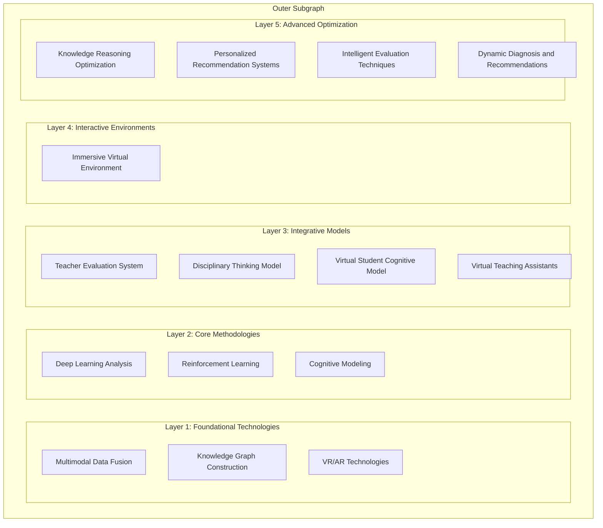
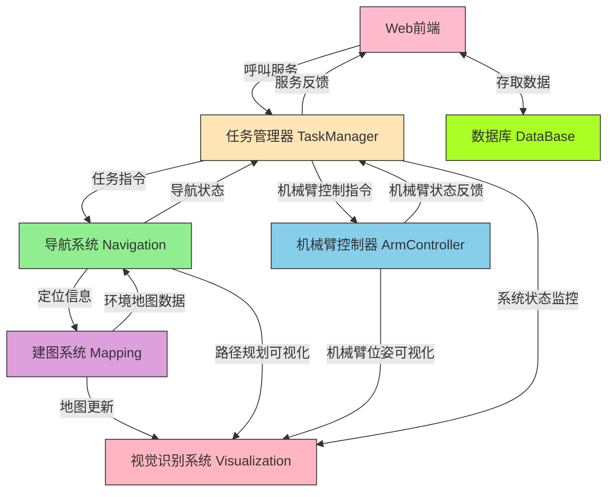
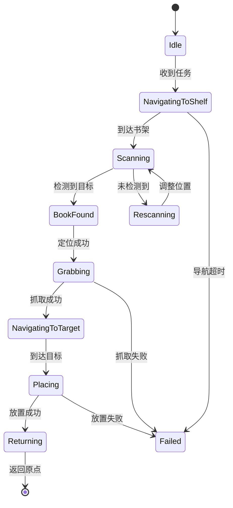

# 设计图

## 系统架构图

```mermaid
flowchart LR
  subgraph Outer["Outer Subgraph"]
    direction LR

    subgraph Layer1["Layer 1: Foundational Technologies"]
      direction TB
      L1_1["Multimodal Data Fusion"]
      L1_2["Knowledge Graph Construction"]
      L1_3["VR/AR Technologies"]
    end

    subgraph Layer2["Layer 2: Core Methodologies"]
      direction TB
      L2_1["Deep Learning Analysis"]
      L2_2["Reinforcement Learning"]
      L2_3["Cognitive Modeling"]
    end

    subgraph Layer3["Layer 3: Integrative Models"]
      direction TB
      L3_1["Teacher Evaluation System"]
      L3_2["Disciplinary Thinking Model"]
      L3_3["Virtual Student Cognitive Model"]
      L3_4["Virtual Teaching Assistants"]
    end

    subgraph Layer4["Layer 4: Interactive Environments"]
      direction TB
      L4_1["Immersive Virtual Environment"]
    end

    subgraph Layer5["Layer 5: Advanced Optimization"]
      direction TB
      L5_1["Knowledge Reasoning Optimization"]
      L5_2["Personalized Recommendation Systems"]
      L5_3["Intelligent Evaluation Techniques"]
      L5_4["Dynamic Diagnosis and Recommendations"]
    end
  end

  classDef green fill:#9f6,stroke:#333,stroke-width:2px;
  classDef orange fill:#f96,stroke:#333,stroke-width:4px;
  classDef blue fill:#add8e6,stroke:#333,stroke-width:2px;
  classDef purple fill:#dda0dd,stroke:#333,stroke-width:2px;
  classDef pink fill:#ffb6c1,stroke:#333,stroke-width:2px;

  class Layer1 green;
  class Layer2 orange;
  class Layer3 blue;
  class Layer4 purple;
  class Layer5 pink;

  %% 设置每个内部 subgraph 的宽度一致
  style Layer1 width:1200px;
  style Layer2 width:1200px;
  style Layer3 width:1200px;
  style Layer4 width:1200px;
  style Layer5 width:1200px;
```

## 系统依赖关系图

```mermaid
graph TD
    F[Web前端] -->|呼叫服务| A
    F <-->|存取数据| DB[数据库 DataBase]
    A -->|服务反馈| F
    A[任务管理器 TaskManager] -->|任务指令| B[导航系统 Navigation]
    A -->|机械臂控制指令| C[机械臂控制器 ArmController]
    D[建图系统 Mapping] -->|环境地图数据| B
    B -->|定位信息| D
    B -->|导航状态| A
    C -->|机械臂状态反馈| A
    D -->|地图更新| E[视觉识别系统 Visualization]
    B -->|路径规划可视化| E
    C -->|机械臂位姿可视化| E
    A -->|系统状态监控| E
    
    style A fill:#FFE4B5,stroke:#333
    style B fill:#90EE90,stroke:#333
    style C fill:#87CEEB,stroke:#333
    style D fill:#DDA0DD,stroke:#333
    style E fill:#FFB6C1,stroke:#333
    style F fill:#FBCF, stroke:#333
    style DB fill:#AAFF25,stroke:#333
```

## 系统状态图

```mermaid
stateDiagram-v2
    [*] --> Idle
    Idle --> NavigatingToShelf: 收到任务
    NavigatingToShelf --> Scanning: 到达书架
    Scanning --> BookFound: 检测到目标
    Scanning --> Rescanning: 未检测到
    Rescanning --> Scanning: 调整位置
    BookFound --> Grabbing: 定位成功
    Grabbing --> NavigatingToTarget: 抓取成功
    NavigatingToTarget --> Placing: 到达目标
    Placing --> Returning: 放置成功
    Returning --> [*]: 返回原点
    NavigatingToShelf --> Failed: 导航超时
    Grabbing --> Failed: 抓取失败
    Placing --> Failed: 放置失败
```
