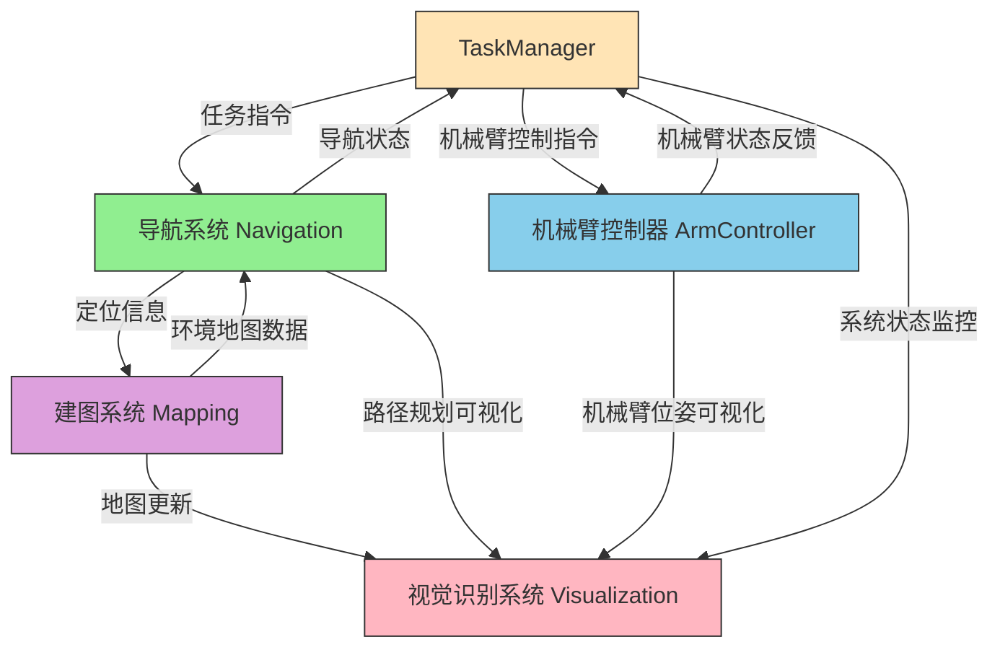
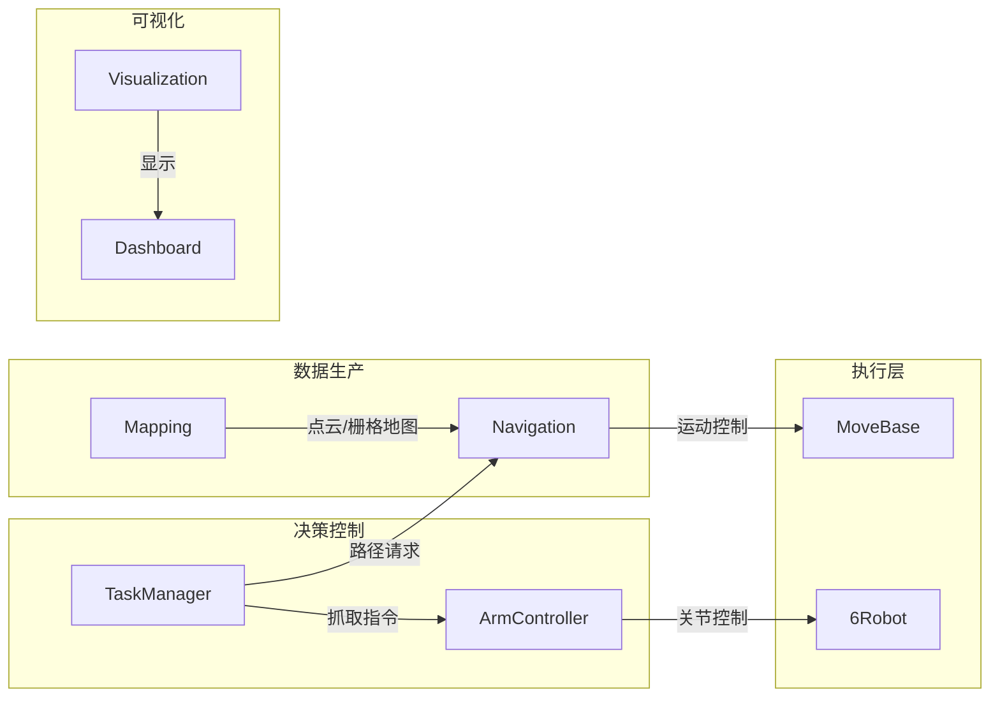
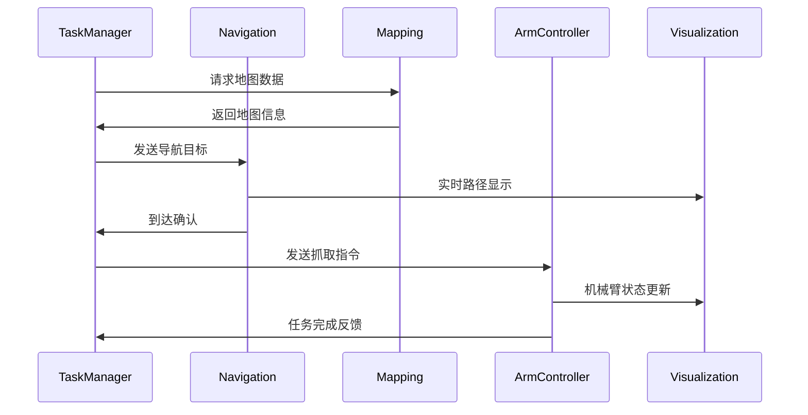
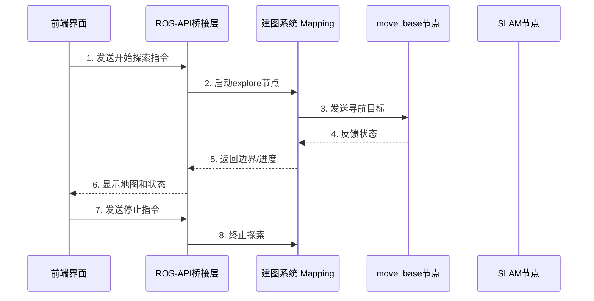
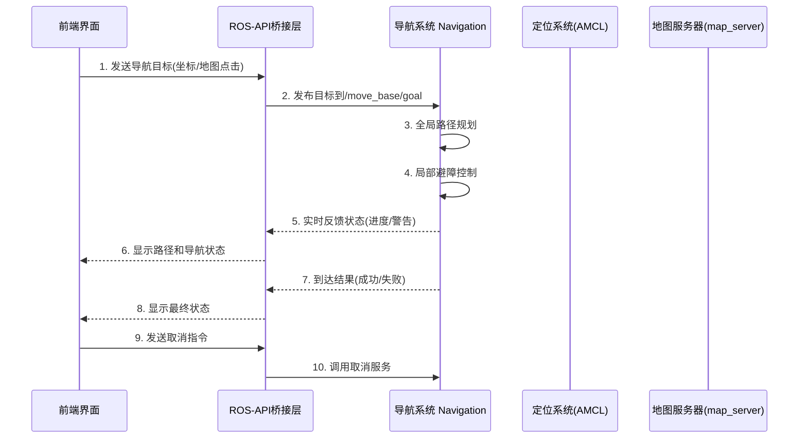
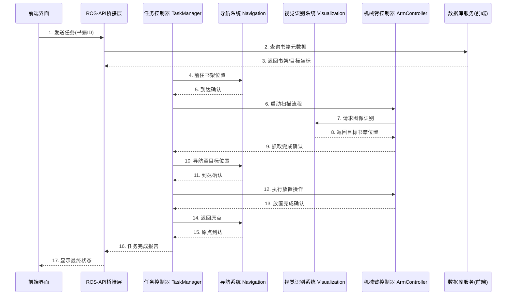
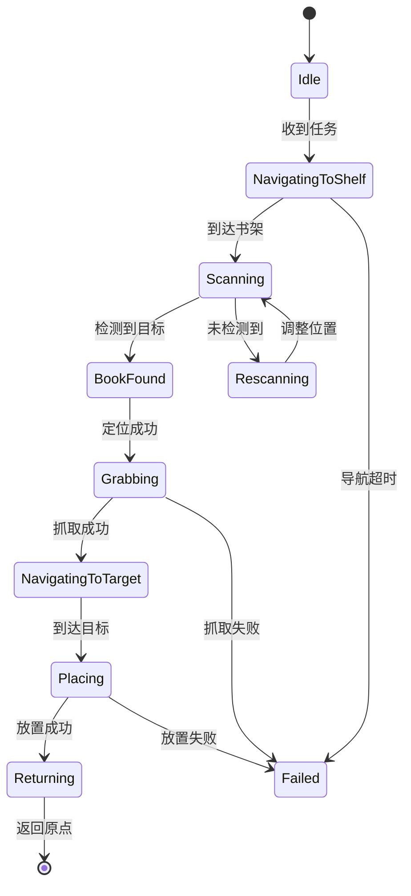
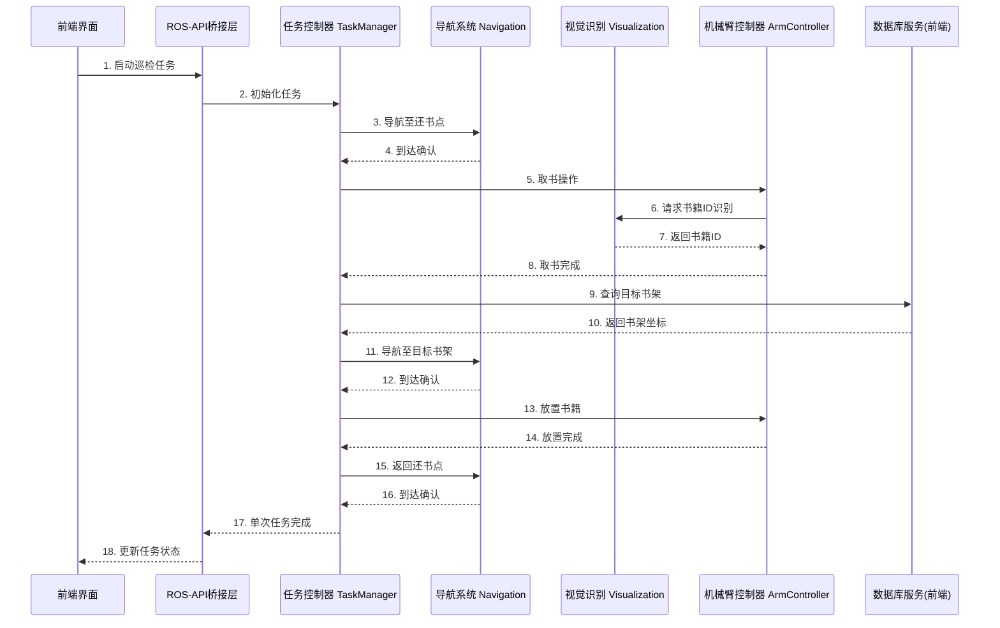
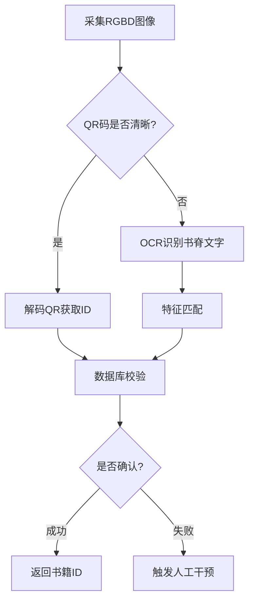

# ROS后端设计草稿

## 〇、系统架构

### ROS后端



一般数据流图：



一般时序关系：



## 一、自动建图

### 0. `explore_lite`的安装

一般`explore-lite`包并不默认自带，需要自行安装：

```bash
sudo apt install ros-noetic-explore-lite
```

---

### 1. **交互流程架构**


---

### 2. **关键交互接口**
#### **(1) 前端 → ROS 后端**
| 指令类型       | ROS 接口                  | 实现方式                          | 示例代码                          |
|----------------|---------------------------|-----------------------------------|-----------------------------------|
| **启动探索**   | `/mapping/start`服务   | 调用launch文件或启动节点          | `roslaunch my_robot explore.launch` |
| **停止探索**   | `/mapping/frontiers`服务      | 发布空边界消息                    | 见下文Python示例                  |
| **设置参数**   | `rosparam`                | 动态修改参数                      | `rosparam set /explore/min_frontier_size 0.5` |

> 需要考虑的是，有必要允许一个机器人存多张地图吗？然后每次导航前都指定采用某个地图？

#### **(2) ROS 后端 → 前端**
| 数据类型       | ROS 话题/服务             | 用途                              |
|----------------|---------------------------|-----------------------------------|
| **地图数据**   | `/map` (OccupancyGrid)    | 实时显示SLAM地图                  |
| **边界信息**   | `/explore/frontiers`      | 可视化探索边界（GridCells格式）   |
| **机器人位姿** | `/amcl_pose` 或 `/tf`     | 显示机器人位置                    |
| **探索状态**   | `/move_base/status`       | 检测是否卡住或完成                |
---

## 二、导航引导

#### **1. 系统架构设计**


---

#### **2. 核心交互接口定义**

##### **2.1 前端 → ROS后端**
| 功能               | ROS接口类型          | 数据结构                    | ROS接口|示例调用方式                 |
|--------------------|----------------------|----------------------------|---|------------------------------|
| 设置导航目标       | Service   | MoveBaseGoal         | `navigation/navigation`服务 |点击地图发送(x,y,θ)          |
| 取消当前导航       | Service              | move_base/cancel           | `navigation/abort`服务 |点击取消按钮                 |
| 设置导航参数       | Dynamic Reconfigure  | move_base/参数组           | (在调用`navigation/navigation`动作时设置) |调整最大速度等参数           |
| 加载指定地图       | Service (map_server) | nav_msgs/LoadMap           | `navigation/map`服务 |切换楼层地图                 |

##### **2.2 ROS后端 → 前端**
| 数据类型            | ROS接口               | 更新频率 | 用途                         |
|---------------------|-----------------------|----------|------------------------------|
| 机器人实时位姿      | /amcl_pose (PoseWithCovarianceStamped) | 10Hz    | 在地图上显示机器人位置       |
| 全局路径规划结果    | /move_base/NavfnROS/plan (Path)       | 按需     | 显示蓝色路径线               |
| 局部轨迹规划        | /move_base/DWAPlannerROS/local_plan (Path) | 5Hz    | 显示绿色局部轨迹             |
| 导航状态反馈        | /move_base/feedback (MoveBaseActionFeedback) | 1Hz    | 显示"正在绕过障碍物"等状态   |
| 代价地图可视化      | /move_base/global_costmap/costmap (OccupancyGrid) | 1Hz    | 显示红色禁区区域             |

---

#### **4. 异常处理机制设计**

##### **4.1 导航失败分类处理**
| 错误类型            | 检测方式                          | 前端响应策略                   |
|---------------------|-----------------------------------|------------------------------|
| 目标不可达          | /move_base/status返回ABORTED      | 显示红色警告，建议调整目标点   |
| 长时间路径规划失败  | 监控全局规划超时(>10秒)           | 重新路径规划       |
| 动态障碍物阻挡      | 局部代价地图突然变化              | 显示黄色警示，启动自动避障     |

##### **4.2 自动避障代码示例**

完整代码示例在`src\navigation\scripts\simple_goal.py`中。

```python
# 监听进度，实现动态避障
def obstacle_detect(self, msg):
    if (self.reach_flag == False and msg.ranges[180] < 0.5):
        self.renavigate()
        rospy.sleep(1)

rospy.init_node("simple_goal")  
radar_obstacle_detect = rospy.Subscriber("scan", LaserScan, self.obstacle_detect)
rospy.spin()
```

#### **6. 性能优化策略**
1. **数据压缩传输**：对地图数据采用`PNG`编码压缩（通过`map_to_image`节点）
2. **差分更新**：仅传输路径/位置的变化部分而非全量数据
3. **带宽自适应**：根据网络质量动态调整传输频率：
   ```javascript
   // 动态调整话题频率
   function adjustPublishRate(baseRate) {
     const netQuality = checkNetwork();
     const actualRate = netQuality === 'good' ? baseRate : Math.floor(baseRate/2);
     $(".topic-config").each(() => {
       this.throttleRate = actualRate;
     });
   }
   ```

---

## 三、书籍搬运

#### **1. 系统架构设计**


---

#### **2. 核心交互接口定义**

##### **2.1 数据库结构设计**
| 表名           | 字段                     | 示例值                 |
|----------------|--------------------------|-----------------------|
| book_info      | id(PK), title, isbn      | 1001, "ROS指南", 9787... |
| shelf_location | book_id(FK), x, y, theta | 1001, 3.5, 2.1, 0.0   |
| target_location| book_id(FK), x, y        | 1001, 5.2, 4.8        |

##### **2.2 ROS服务接口**
| 服务名称                | 服务类型                      | 功能描述                   |
|-------------------------|-------------------------------|---------------------------|
| /arm_control            | `book_fetch/fetch`  | 机械臂抓取指定物品 |
| /vision_identify        | `/book_identify`  | 请求视觉识别，根据书籍编号的匹配判断需要抓取哪本书籍               |

##### **2.3 ROS话题接口**
| 话题名称                | 消息类型                   | 用途                     |
|-------------------------|---------------------------|--------------------------|
| `/book_scan_result`       | String                    | 实时传输扫描到的书籍ID    |
| `/task_progress`       | UInt8                     | 任务阶段进度百分比        |

---

#### **4. 任务状态机设计**


---

#### **5. 异常处理机制**

##### **常见故障处理策略**
| 故障类型           | 检测方法                          | 恢复策略                     |
|--------------------|-----------------------------------|------------------------------|
| 视觉识别失败       | 扫描后5秒内无结果                | 重新扫描     |
| 书籍抓取失败       | 多次扫描后仍无结果             | 向前端报错并暂停任务           |
| 路径规划失败       | move_base返回ABORTED状态         | 切换为人工遥控模式           |
| 书籍错位           | 视觉校验与数据库ID不匹配         | 触发报警并暂停任务           |
---

#### **7. 性能优化策略**

##### **7.1 路径规划优化**
```yaml
# 导航参数优化
DWAPlannerROS:
  sim_time: 3.0
  path_distance_bias: 32.0
  goal_distance_bias: 24.0
  occdist_scale: 0.1
```

##### **7.2 视觉识别加速**
```python
# 使用多线程处理图像
from concurrent.futures import ThreadPoolExecutor

class VisionProcessor:
    def __init__(self):
        self.executor = ThreadPoolExecutor(max_workers=4)
        
    def async_detect(self, image_msg):
        future = self.executor.submit(self.detect_task, image_msg)
        future.add_done_callback(self.result_callback)
```

##### **7.3 数据库缓存机制**
```cpp
// 使用LRU缓存近期查询结果
const int CACHE_SIZE = 50;
std::map<std::string, LocationData> locationCache;

LocationData queryFromCache(string bookId) {
    if(locationCache.count(bookId)){
        return locationCache[bookId];
    } else {
        auto data = dbClient.query(bookId);
        if(locationCache.size() >= CACHE_SIZE) {
            locationCache.erase(locationCache.begin());
        }
        locationCache[bookId] = data;
        return data;
    }
}
```

---

#### **8. 系统验证方案**

##### **8.1 功能测试用例**
```gherkin
Scenario: 完整书籍搬运流程
  Given 数据库中存在ID为1001的书籍记录
  When 前端提交搬运1001的请求
  Then 机器人应依次完成：
    | 步骤               | 预期结果                 |
    | 到达A3书架          | 误差<0.1m               |
    | 识别到1001书籍      | 扫描时间<5秒            |
    | 成功抓取书籍        | 力传感器反馈正常        |
    | 到达B2目标位置      | 导航路径避开障碍        |
    | 正确放置书籍        | 视觉校验确认位置        |
    | 返回充电桩          | 电量消耗<1%           |
```

##### **8.2 性能指标**
| 指标项               | 要求值              |
|----------------------|--------------------|
| 单次任务最长时间     | <5分钟            |
| 书籍识别准确率       | ≥99%              |
| 机械臂抓取成功率     | ≥95%              |
| 导航路径规划时间     | <3秒              |
| 系统恢复时间(急停后) | <10秒             |

---

## 四、书架巡检

#### **1. 系统架构设计**


---

#### **2. 核心交互接口定义**

##### **2.1 数据库扩展设计参考**
| 表名           | 新增字段                 | 说明                          |
|----------------|--------------------------|------------------------------|
| return_station | station_id, x, y, theta  | 还书点位置信息(支持多还书点)  |
| book_location  | last_return_time         | 记录最近归还时间              |

##### **2.2 新增ROS服务接口**
| 服务名称                | 服务类型                      | 功能描述                   |
|-------------------------|-------------------------------|---------------------------|
| /get_next_book          | `book_inspection/GetNextBook`   | 获取还书点待处理书籍       |
| /shelf_verify           | `book_inspection/ShelfCheck`    | 书架空位校验服务           |

##### **2.3 新增ROS话题**
| 话题名称                | 消息类型                   | 用途                     |
|-------------------------|---------------------------|--------------------------|
| /return_station_status  | `book_inspection/StationStatus` | 还书点书籍存在检测        |

---

#### **4. 视觉识别增强方案**

##### **4.1 多模态识别流程**


##### **4.2 深度学习集成（参考）**
```python
class BookIdentifier:
    def __init__(self):
        # 加载预训练模型
        self.qr_model = load_model('qr_detector.h5')
        self.ocr_model = load_model('book_spine_ocr.h5')
        
    def identify_book(self, image):
        # 第一步：QR码检测
        qr_roi = self.qr_model.detect(image)
        if qr_roi:
            return decode_qr(qr_roi)
            
        # 第二步：书脊文字识别
        text_region = self.ocr_model.segment(image)
        return self.ocr_model.recognize(text_region)
```

---

#### **5. 异常处理与恢复**

##### **5.1 典型故障处理策略**
| 故障场景            | 检测方法                  | 恢复策略                     |
|---------------------|---------------------------|------------------------------|
| 还书点无书籍        | 视觉连续3次检测失败       | 标记为已完成，转至下一还书点 |
| 书架满载            | 位姿校验服务返回失败      | 暂存至临时区域并触发警报     |
| 书籍ID无法识别      | 多模态识别均失败          | 转入人工处理队列             |
| 多次放置失败        | 力传感器异常波动          | 重新扫描书架结构             |

##### **5.2 状态回滚机制**
```python
class TransactionManager:
    def __init__(self):
        self.transaction_stack = []
        
    def begin_transaction(self):
        self.transaction_stack.append({
            'position': get_robot_pose(),
            'arm_state': arm.get_current_state(),
            'book_held': current_book_id
        })
        
    def rollback(self):
        if self.transaction_stack:
            state = self.transaction_stack.pop()
            # 回退到上一个安全状态
            nav.go_to(state['position'])
            arm.recover_state(state['arm_state'])
            if state['book_held']:
                handle_book_rollback(state['book_held'])
```

---

#### **7. 系统优化策略**

##### **7.1 路径规划优化**
```yaml
# 多目标点TSP优化配置
global_planner:
  use_tsp_solver: true
  tsp_heuristic: simulated_annealing
  max_stations_per_cycle: 8
```

##### **7.2 数据库查询优化**
```sql
-- 建立复合索引加速查询
CREATE INDEX idx_book_status ON book_location 
(book_id, status, shelf_id) INCLUDE (x, y);
```

##### **7.3 机械臂轨迹缓存**
```cpp
// 预计算常用轨迹
void ArmController::precomputeTrajectories() {
    precomputed["return_pick"] = computeTrajectory(home_pose, return_pick_pose);
    precomputed["shelf_place"] = computeTrajectory(home_pose, shelf_place_pose);
}
```

---

#### **8. 系统验证方案**

##### **8.1 测试用例矩阵**
| 测试维度         | 测试场景                  | 预期结果               |
|------------------|--------------------------|-----------------------|
| 正常流程         | 单本书正确识别放置        | 完成时间<3分钟        |
| 异常处理         | 还书点空置检测            | 10秒内转至下一站点    |
| 性能压力         | 连续处理50本书籍          | 无内存泄漏，成功率>98%|
| 故障恢复         | 人为中断后继续任务        | 状态恢复误差<5cm      |

##### **8.2 验收指标**
| 指标类别         | 项目                   | 标准值             |
|------------------|------------------------|-------------------|
| 功能性指标       | 书籍识别准确率         | ≥99.5%            |
|                  | 放置位置精度           | ±2cm              |
| 时效性指标       | 单本书平均处理时间     | ≤150秒            |
|                  | 系统响应延迟           | <500ms            |
| 可靠性指标       | 连续运行故障间隔       | ≥72小时           |
|                  | 急停恢复时间           | ≤8秒              |

---

## 五、接口设计

本节整合前文，给出所有需要自行实现的接口设计。

### Mapping包

|ROS接口|接口类型|功能描述|输入参数|返回结果|前置条件|后置条件|
|:---:|:---:|:---:|:---:|:---:|:---:|:---:|
|`/mapping/start`|Service 服务|开始自动建图|探索范围`width`和`length`|建图完成提示|无|自动保存地图|
|`/mapping/manual`|Topic 话题|开始手动建图(此后需要手动操控机器人移动)|
|`/mapping/frontiers`|服务|结束建图并自动保存地图|是否保存地图`save`|建图停止提示|当前正在建图过程中(手动建图或自动建图均可)|根据`save`确定保存地图与否|

### Navigation包

|ROS接口|接口类型|功能描述|输入参数|返回结果|前置条件|后置条件|
|:---:|:---:|:---:|:---:|:---:|:---:|:---:|
|`navigation/navigation`|Service 服务|导航前往指定位置|`MoveBaseGoal`|导航是否成功|无|机器人已经抵达指定位置|
|`navigation/abort`|Service 服务|取消当前导航|`MoveBaseGoal`|导航取消提示|当前正在导航过程中|机器人停止导航|
|`navigation/map` **(目前不确定是否需要)**|Service 服务|加载指定地图|-|-|-|-|

### Visualization包


