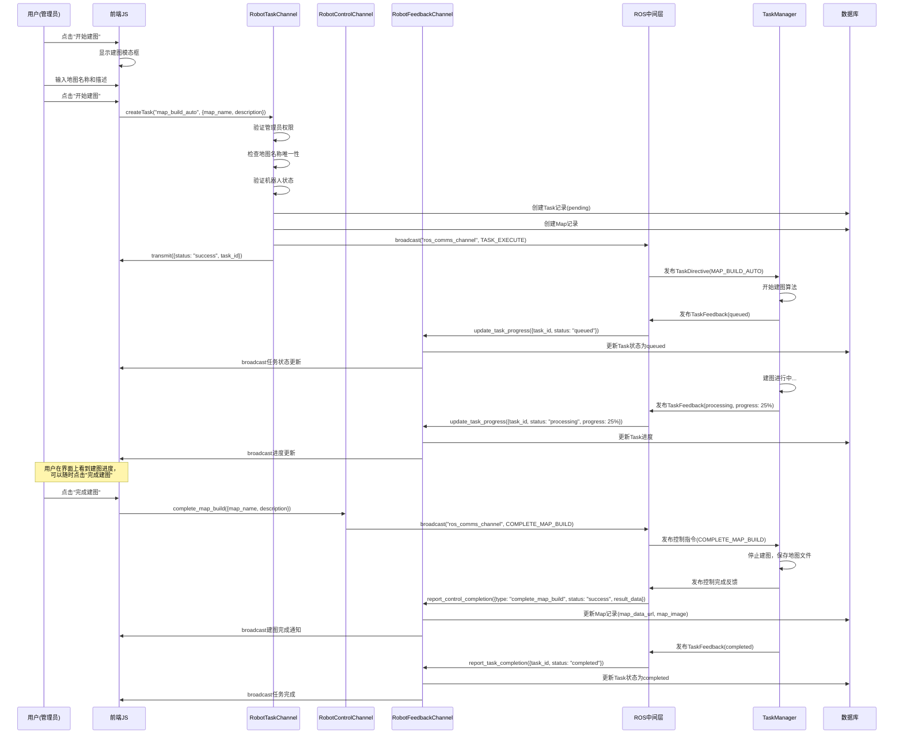
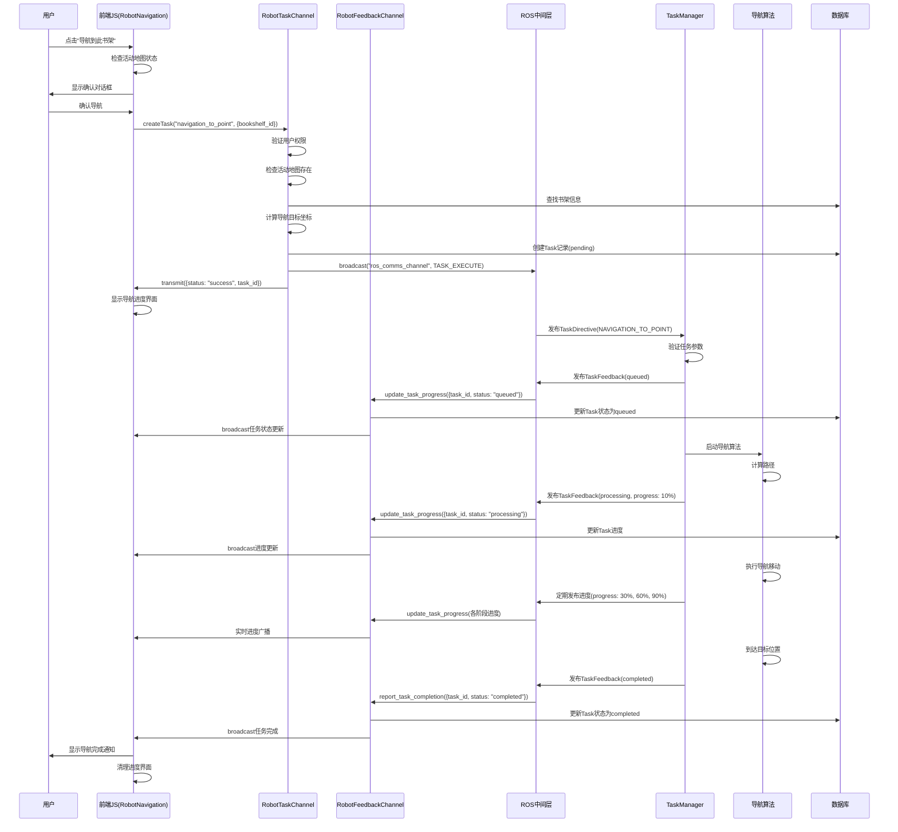
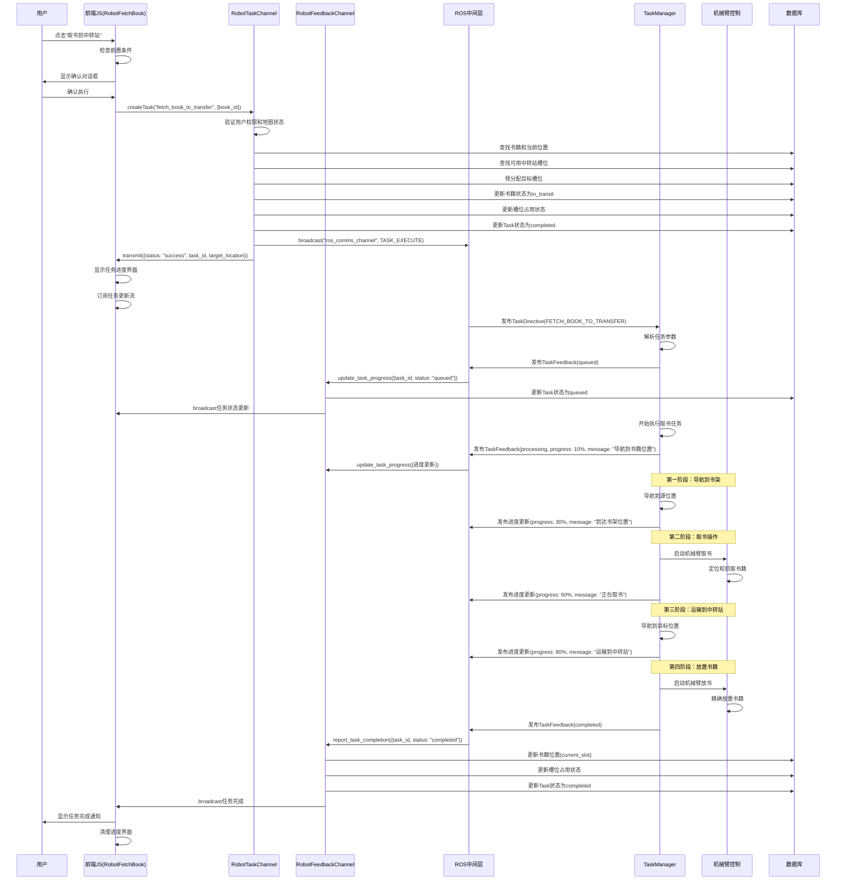

# Rails Web端详细设计

## 0. 架构原则与职责划分

本项目遵循现代Web应用设计原则，将用户交互、业务逻辑处理和与外部系统 (ROS机器人) 的通信进行合理分层，以实现高内聚、低耦合的系统架构。

**项目完成度：约 90%** 🚀

本设计文档反映了当前项目的实际实现状态，由于某些限制，其中书架巡检功能（第5部分）尚未完成实现。

*  **前端 (Web 浏览器 - Stimulus JS, Action Cable JS Clients):**
    * 负责用户界面的渲染和交互。
    * 通过 Stimulus Controllers 响应用户操作。
    *  使用封装好的 JavaScript Action Cable Client 模块与后端 Rails Channels 进行双向实时通信，发起指令、订阅和接收状态更新。
    * 动态更新页面内容以反映来自后端的实时数据。
* **后端 - Rails Action Cable Channels (`app/channels/*.rb`):**
    * 作为前端与后端实时交互的主要入口和业务逻辑协调者。
    *  **`RobotTaskChannel`**: 处理用户发起的、通常需要机器人执行的后台任务（如建图、导航、取放书籍）。负责验证权限、创建 `Task` 模型记录，并将格式化的任务指令通过特定流广播给 ROS 中间层。
    * **`RobotControlChannel`**: 处理用户发起的、即时性的机器人控制指令（如手动移动、急停、取消任务、完成建图）。负责验证权限，并将格式化的控制指令通过特定流广播给 ROS 中间层。
    * **`RobotFeedbackChannel`**: 作为 ROS 中间层向 Rails 发送反馈的入口。其定义的 actions (方法) 被 ROS 中间层调用，负责解析收到的数据、更新相关的 Rails 模型 (如 `Task`, `RobotStatus`, `Map`)、记录系统日志，并通过其他特定 Channel 将处理后的信息广播给前端。
    * **`RosCommsSubscriberChannel`**: (后端专用) 供 ROS 中间层节点订阅。它 `stream_from` 一个特定的广播流 (e.g., `"ros_comms_channel"`)，该流汇集了所有从 `RobotTaskChannel` 和 `RobotControlChannel` 发往 ROS 的指令。
    * **前端订阅 Channels (`RobotGeneralUpdatesChannel`, `TaskUpdateChannel`):** 供前端 JS 客户端订阅，以接收来自 Rails 后端（通常由 `RobotFeedbackChannel` 或模型回调触发）的通用机器人状态更新和特定任务的进度/结果更新。
*  **后端 - Rails Models (`app/models/*.rb`):**
    * 封装核心数据结构、业务规则、数据校验和关联关系。
    * 例如，`Task` 模型管理任务的生命周期和参数；`RobotStatus` 模型作为单例记录和同步机器人的全局状态；`Map`, `Book`, `Bookshelf`, `Slot` 管理各自的领域数据。
    *  包含一些同步的业务逻辑（如 `RobotStatus.current.update_status_from_ros`）。
    * 通过 `after_commit` 等回调，在数据变化时触发向特定 Action Cable 流的广播 (例如，`Task` 更新时广播到 `TaskUpdateChannel`)。
* **后端 - Rails HTTP Controllers (`app/controllers/*.rb`):**
    * 主要负责传统的、同步的 HTTP 请求/响应周期。
    * 处理标准 CRUD 操作，特别是针对不需要与 ROS 实时交互的元数据管理（如用户管理、书籍/书架的基础信息编辑）。
    * 为前端视图准备和渲染数据。
    * **不直接处理**需要与 ROS 进行实时双向通信或长时间后台任务的发起与监控。这些职责已移交给 Action Cable Channels。
* **ROS 中间层 (`web_robot_bridge_node.py`, `task_manager_node.py`):**
    * **`web_robot_bridge`**: 作为 Rails Action Cable 与 ROS Topic/Service 之间的桥梁。连接并订阅 Rails 的 `RosCommsSubscriberChannel` 以接收指令，调用 Rails `RobotFeedbackChannel` 的 actions 来发送反馈。将收到的 Rails 指令转换为 ROS 消息发布给 `task_manager`，并将来自 `task_manager` 的 ROS 反馈消息转换为 Action Cable 消息发送给 Rails。
    * **`task_manager`**: 负责实际的任务调度、与机器人底层驱动/算法节点 (通过 ROS Topic/Service) 的交互、维护机器人的核心状态，并将任务进度和结果反馈给 `web_robot_bridge`。


## 1. 统一通信规范与方法

本节定义 Rails 应用与 ROS 中间层节点之间通过 Action Cable 进行通信的基本规范和数据结构。

### 1.1. Action Cable Channels

* **`RosCommsSubscriberChannel`（汇集 `RobotCommandChannel` 和 `RobotControlChannel` 的信息，一并发送给 ROS）**

*   **`RobotTaskChannel`（取代 `RobotCommandChannel` 的部分功能，专注于任务指令）:**
    *   **用途:** 前端发起任务 -> Rails 创建 `Task` 记录 -> Rails 通过此 Channel 向 ROS 发送任务指令。
    *   **Rails 端（由前端调用，触发任务创建和指令发送）:**
        *   `perform(action_name, data)`: 前端调用，如 `perform('create_mapping_task', { map_name: "..." })`。
        *   Rails 内部逻辑：
            1.  验证用户权限。
            2.  校验 `data` 参数。
            3.  创建 `Task` 记录（e.g., `Task.create(type: 'MAP_BUILD_AUTO', user: Current.user, parameters: data, status: 'pending')`）。
            4.  向 ROS 广播任务指令（见 1.2.1）。
    *   **ROS 端:** 订阅此 Channel，接收任务指令。
*   **`RobotControlChannel`（用于非任务性的、即时控制指令）:**
    *   **用途:** 前端发送简单的、即时的控制指令（如手动移动、急停、摄像头开关）。
    *   **Rails 端（由前端调用，直接广播给 ROS）:**
        *   `move(data)`: `{ direction, speed }`
        *   `stop_motion(data)`: `{}`（停止当前移动）
        *   `cancel_task(data)`: `{taskId}`（取消任务，与创建任务不同）
        *   `complete_map_build(data)`: `{mapName, description}`（结束建图）
        *   `emergency_stop(data)`: `{}`
        *   `toggle_camera_stream(data)`: `{ enable: true/false }`
    *   **ROS 端:** 订阅此 Channel，接收并执行这些即时控制。
*   **`RobotFeedbackChannel`（取代 `RobotStatusChannel` 的部分功能，专注于任务反馈和状态）:**
    *   **用途:** ROS 节点向 Rails 发送机器人状态、任务进度、任务结果、传感器数据等。
    *   **Rails 端（由 ROS 节点调用）:**
        *   `update_robot_state(data)`: `payload: { pose: {x,y,theta}, velocity: {linear,angular}, battery_level }`
        *   `update_task_progress(data)`: `payload: { task_id, status_from_ros, progress_percentage, message, intermediate_results }`
        *   `report_control_completion(data)`: `payload: { final_status_from_ros, message }`
        *   `report_task_completion(data)`: `payload: { task_id, final_status_from_ros, result_data }`
        *   `report_isbn_scan(data)`: `payload: { task_id（optional, if part of a task）, slot_id_scanned, scanned_isbn, confidence, image_snippet_url }`
    *   **ROS 端:** 调用此 Channel 的动作发送反馈。
    *   **前端:** 由 Rails 进一步处理后广播到特定前端 Channel，接收更新。
*   **`RobotGeneralUpdatesChannel、TaskUpdateChannel（前端订阅相关的更新）`**

### 1.2. 消息结构约定

#### 1.2.1. Rails -> ROS（通过 `RobotTaskChannel` 或 `RobotControlChannel`）

*   **任务指令（从 `RobotTaskChannel` 广播）:**
    ```json
    {
      "command_type": "TASK_EXECUTE", // 固定类型，表明是任务执行请求
      "task": {
        "id": 123, // Task ID from Rails DB
        "type": "MAP_BUILD_AUTO", // Task type（e.g., from Tasks.type enum）
        "priority": 0, // Task priority
        "parameters": { // Task-specific parameters
          "map_name": "Floor1_North",
          // ... other params like target_coords, book_isbn, etc.
        },
      }
    }
    ```
*   **即时控制指令（从 `RobotControlChannel` 广播）:**
    
    ```json
    {
      "command_type": "MOVE", // e.g., MOVE, EMERGENCY_STOP, TOGGLE_CAMERA
      "payload": {
        "direction": "forward",
        "speed": 0.5
        // ... other params for specific command_type
      }
    }
    ```

#### 1.2.2. ROS -> Rails（通过 `RobotFeedbackChannel`）

所有发送到 `RobotFeedbackChannel` 的消息，其 `data` 参数（即 Channel 动作的参数） 结构如下：

```json
// Example for update_task_progress
{
  "action": "report_task_completion", // Rails Channel 动作名
  "payload": {
    "task_id": 123, // Corresponds to Task.id in Rails
    "final_status_from_ros": "tm_task_queued", // Detailed status from ROS
    "message": "TM: Task queued with priority ...",
    "result_results": { /* task-specific result data */ }
  }
}
```

### 1.3. Rails 端处理模式（for `RobotFeedbackChannel`）

当 `RobotFeedbackChannel` 收到来自 ROS 的消息时：

1.  **Authentication:** 确保消息来自已认证的 ROS 客户端（`connection.robot_client`）.
2.  **Find Task（if `task_id` present）:** `Task.find_by(id: payload[:task_id])`.
3.  **Update Task Record:** 根据 `payload` 内容更新 `Task` 记录的 `status`, `progress_details`, `result_data`, `started_at`, `completed_at` 等字段。
    *   `status_from_ros` 需要映射到 Rails `Tasks.status` 枚举值。
4.  **Database Updates（if applicable）:**
    *   例如，`report_task_completion` for `FETCH_BOOK_TO_TRANSFER` 成功时，更新 `Book.current_slot_id` 和 `Slot.is_occupied`。
    *   例如，`report_control_completion` for `complete_map_build` 成功时，更新 `Map` 记录。
5.  **System Log:** 创建 `SystemLog` 记录，关联 `task_id`, `user_id`（from Task）, `message`（from payload or generated）, `severity`, `log_type`（'task', 'robot'）.
6.  **Broadcast to Frontend:** 将处理后的信息（或原始 `payload` 的一部分） 广播给订阅了相关信息的前端用户。这可能通过一个新的、专门面向前端的 Channel（e.g., `RobotGeneralUpdatesChannel`） 或直接在 `RobotFeedbackChannel` 上进行。

---


## 2. 自动建图 

### 2.1. 功能概述

管理员用户通过 Web 界面发起自动建图任务，实时监控建图过程，执行"停止建图"后保存建图结果。后续可加载指定的已建地图。

### 2.2. 前端界面关键元素

#### 2.2.1. 主控制台界面

* **触发元素**

* **状态显示**

#### 2.2.2. 建图模态框界面

* **地图命名输入**

* **任务控制按钮**

#### 2.2.3. 实时进度显示

* **任务状态指示器**

### 2.3. Rails 端核心模型与控制器

#### 2.3.1. 数据模型

* **Task 模型**

* **Map 模型**

* **RobotStatus 模型**

#### 2.3.2. Channel 控制器

* **RobotTaskChannel**

* **RobotControlChannel**

### 2.4. 详细流程图



### 2.5. 关键接口表

| 操作 | 触发方 | 目标方 | Channel & Action / HTTP Endpoint | 数据示例（Payload/Params） |
| ---- | ------ | ------ | -------------------------------- | -------------------------- |
| 创建建图任务 | 前端JS | RobotTaskChannel | `create_task` | `{"task_type": "map_build_auto", "parameters": {"map_name": "Floor1_Map", "description": "一楼地图"}}` |
| 完成建图 | 前端JS | RobotControlChannel | `complete_map_build` | `{"map_name": "Floor1_Map", "description": "一楼地图"}` |
| 任务进度更新 | ROS | RobotFeedbackChannel | `update_task_progress` | `{"payload": {"task_id": 123, "status_from_ros": "processing", "progress_percentage": 45, "message": "建图进行中..."}}` |
| 控制完成反馈 | ROS | RobotFeedbackChannel | `report_control_completion` | `{"payload": {"type": "complete_map_build", "final_status_from_ros": "success", "result_data": {"map_id": 5, "map_data_url": "/maps/floor1.yaml"}}}` |
| 任务完成 | ROS | RobotFeedbackChannel | `report_task_completion` | `{"payload": {"task_id": 123, "final_status_from_ros": "completed", "result_data": {"map_files_saved": true}}}` |
| 机器人状态更新 | ROS | RobotFeedbackChannel | `update_robot_state` | `{"payload": {"overall_status": "mapping_auto", "pose": {"x": 1.5, "y": 2.3, "theta": 0.7}}}` |
| 任务状态广播 | Task模型 | 前端订阅 | TaskUpdateChannel流 | `{"type": "task_update", "task": {"id": 123, "status": "processing", "progress_details": {...}}}` |
| 机器人状态广播 | RobotStatus模型 | 前端订阅 | RobotGeneralUpdatesChannel流 | `{"type": "robot_status_model_update", "payload": {"status": "mapping_auto", "current_task_id": 123}}` |


## 3. 导航引导 

### 3.1. 功能概述

用户在书架界面上指定前往某个书架，机器人自主导航至目标位置。实时显示机器人路径和状态。该功能支持从两个入口触发：主控制台的快速导航和书架详情页的专用导航按钮。

### 3.2. 前端界面关键元素

#### 3.2.1. 主控制台快速导航

* **导航按钮**

* **导航模态框**

#### 3.2.2. 书架详情页导航

* **专用导航控制器**

* **导航进度显示**

### 3.3. Rails 端核心模型与控制器

#### 3.3.1. 数据模型

* **Bookshelf 模型**

* **Task 模型导航任务扩展**

#### 3.3.2. JavaScript 控制器

* **RobotNavigationController**

#### 3.3.3. Channel 处理逻辑

* **RobotTaskChannel**

### 3.4. 详细流程图



### 3.5. 关键接口表

| 操作 | 触发方 | 目标方 | Channel & Action / HTTP Endpoint | 数据示例（Payload/Params） |
| ---- | ------ | ------ | -------------------------------- | -------------------------- |
| 创建导航任务 | 前端JS | RobotTaskChannel | `create_task` | `{"task_type": "navigation_to_point", "parameters": {"bookshelf_id": 5}}` |
| 任务进度更新 | ROS | RobotFeedbackChannel | `update_task_progress` | `{"payload": {"task_id": 124, "status_from_ros": "processing", "progress_percentage": 65, "message": "导航进行中，距离目标1.2米"}}` |
| 任务完成反馈 | ROS | RobotFeedbackChannel | `report_task_completion` | `{"payload": {"task_id": 124, "final_status_from_ros": "completed", "result_data": {"arrived_at_target": true, "final_distance_error": 0.15}}}` |
| 机器人位置更新 | ROS | RobotFeedbackChannel | `update_robot_state` | `{"payload": {"overall_status": "navigating", "pose": {"x": 2.5, "y": 3.1, "theta": 1.2}, "velocity": {"linear": 0.3, "angular": 0.1}}}` |
| 获取可用书架 | 前端JS | HTTP API | `GET /bookshelves` | 查询参数: `available_for_navigation=true` |
| 书架坐标信息 | 内部调用 | Bookshelf模型 | `navigation_coordinates` | 返回: `{"x": 5.2, "y": 3.8, "z": 0.0, "oz": 1.57}` |
| 任务状态广播 | Task模型 | 前端订阅 | TaskUpdateChannel流 | `{"type": "task_update", "task": {"id": 124, "status": "processing", "progress_details": {"ros_updates": [...]}}}` |
| 机器人状态广播 | RobotStatus模型 | 前端订阅 | RobotGeneralUpdatesChannel流 | `{"type": "robot_status_model_update", "payload": {"status": "navigating", "current_task_id": 124}}` |


## 4. 书籍搬运（取书到中转站） 

### 4.1. 功能概述 

用户从书籍列表或详情页中选择一本书，命令机器人将其从当前实际位置取到系统分配的中转站空闲插槽。该功能包括智能槽位分配、坐标计算、状态更新等完整流程。

### 4.2. 前端界面关键元素

#### 4.2.1. 书籍详情页操作 (`books/show.html.erb`)

* **取书控制器**

* **任务进度显示**

#### 4.2.2. 主控制台快速取书

* **快速取书按钮**

### 4.3. Rails 端核心模型与控制器

#### 4.3.1. 数据模型设计

* **Book 模型扩展**

* **Slot 模型**

* **Task 模型取书任务扩展**

#### 4.3.2. JavaScript 控制器

* **RobotFetchBookController**

#### 4.3.3. Channel 处理逻辑

* **RobotTaskChannel 取书任务处理**

* **RobotFeedbackChannel 取书任务完成处理**

### 4.4. 详细流程图



### 4.5. 关键接口表 

| 操作 | 触发方 | 目标方 | Channel & Action / HTTP Endpoint | 数据示例（Payload/Params） |
| ---- | ------ | ------ | -------------------------------- | -------------------------- |
| 创建取书任务 | 前端JS | RobotTaskChannel | `create_task` | `{"task_type": "fetch_book_to_transfer", "parameters": {"book_id": 15}}` |
| 任务进度更新 | ROS | RobotFeedbackChannel | `update_task_progress` | `{"payload": {"task_id": 125, "status_from_ros": "processing", "progress_percentage": 45, "message": "正在取书操作中"}}` |
| 任务完成反馈 | ROS | RobotFeedbackChannel | `report_task_completion` | `{"payload": {"task_id": 125, "final_status_from_ros": "completed", "result_data": {"book_moved": true, "final_position_confirmed": true}}}` |
| 查找可用槽位 | 内部调用 | Slot模型 | `find_available_transit_slot` | 返回: `Slot实例或nil` |
| 计算绝对坐标 | 内部调用 | Slot模型 | `absolute_coordinates` | 返回: `{"x": 2.5, "y": 3.2, "z": 1.1, "oz": 0.0}` |
| 书籍状态检查 | 内部调用 | Book模型 | `can_be_fetched?` | 返回: `true/false` |
| 槽位预分配 | 数据库更新 | Slot记录 | `update!(is_occupied: true)` | 字段更新: `is_occupied: true` |
| 书籍状态更新 | 数据库更新 | Book记录 | `update!(status: :in_transit)` | 状态变更: `available -> in_transit -> available` |
| 任务状态广播 | Task模型 | 前端订阅 | TaskUpdateChannel流 | `{"type": "task_update", "task": {"id": 125, "status": "processing", "book_id": 15}}` |


## 5. 书架巡检（此部分还未完成）

### 5.1. 功能概述

**⚠️ 注意：由于ROS系统和实机机器人限制，此功能尚未实现，仅为设计规划**

管理员发起书架巡检任务。机器人自动扫描书架上的书籍，将错位书籍搬运至中转站；然后再将中转站的书籍归位到其应在的插槽。

此功能将包括：
- 自动扫描书架上所有书籍的ISBN
- 识别错位书籍（实际位置与预期位置不符）
- 将错位书籍搬运到中转站
- 将中转站的书籍归位到正确位置
- 更新数据库中的书籍位置信息

### 5.2. 计划实现的任务类型

**预计新增任务类型：**
- `inventory_scan_and_relocate` - 库存扫描与重定位
- `return_book_from_transfer` - 从中转站归还书籍

### 5.3. 预期接口设计

**计划的Channel Actions：**
- `RobotTaskChannel#create_inventory_task` - 创建库存巡检任务
- `RobotFeedbackChannel#report_isbn_scan` - 报告ISBN扫描结果
- `RobotFeedbackChannel#report_book_relocation` - 报告书籍重定位结果

### 5.4. 实现优先级

此功能在项目的待完善功能列表中，计划在以下功能完成后实现：
1. 基础取书功能的优化
2. 导航精度的提升
3. 机械臂操作的稳定性改进

---

**说明：** 当前项目重点关注核心功能的稳定性和可靠性。书架巡检作为高级功能，将在基础功能完全稳定后进行开发。

---

