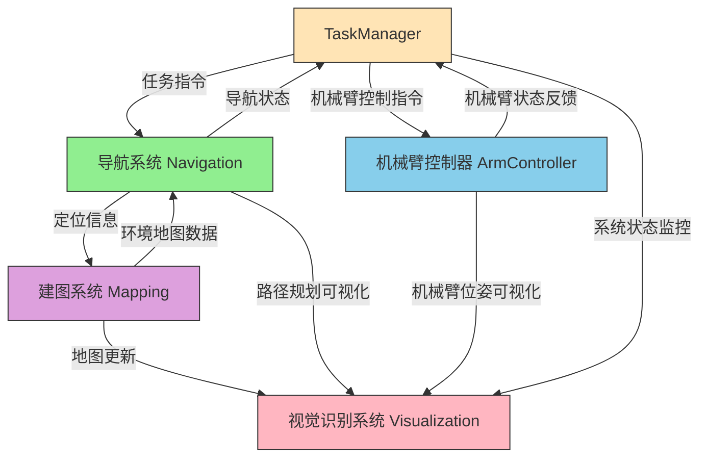
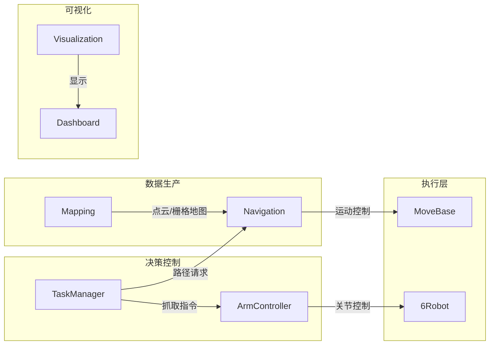
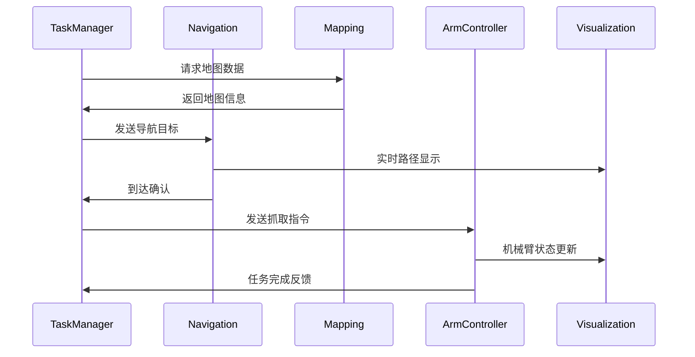
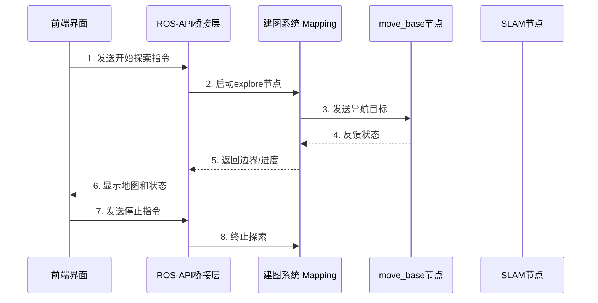
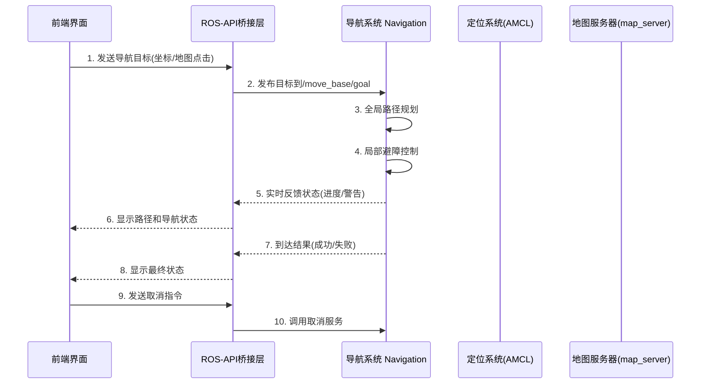
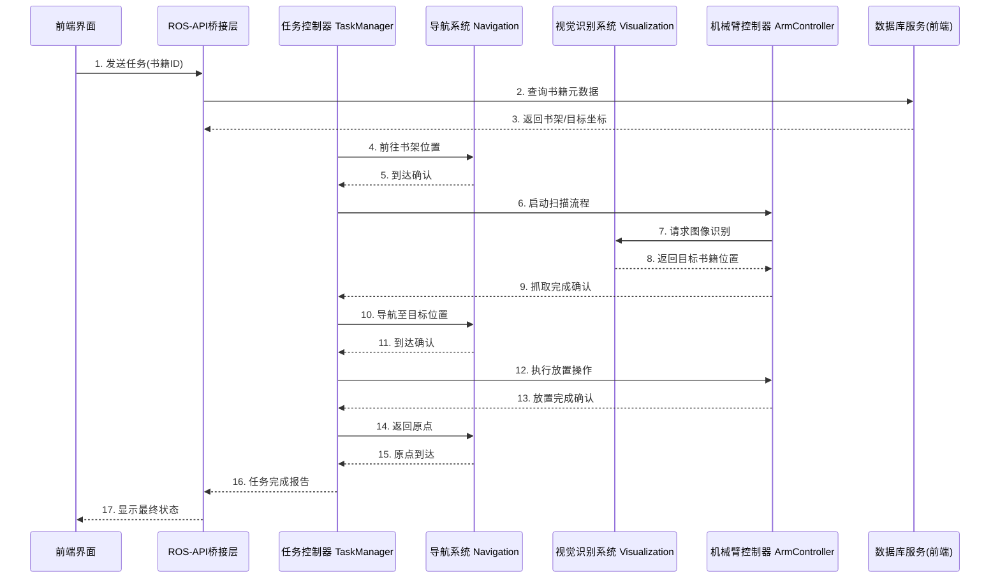
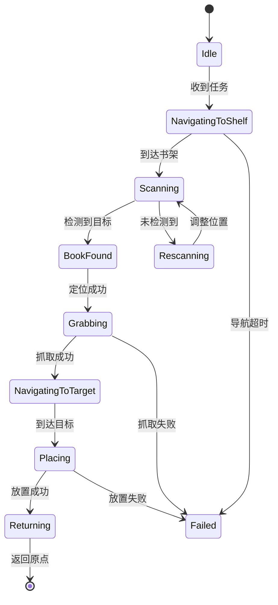
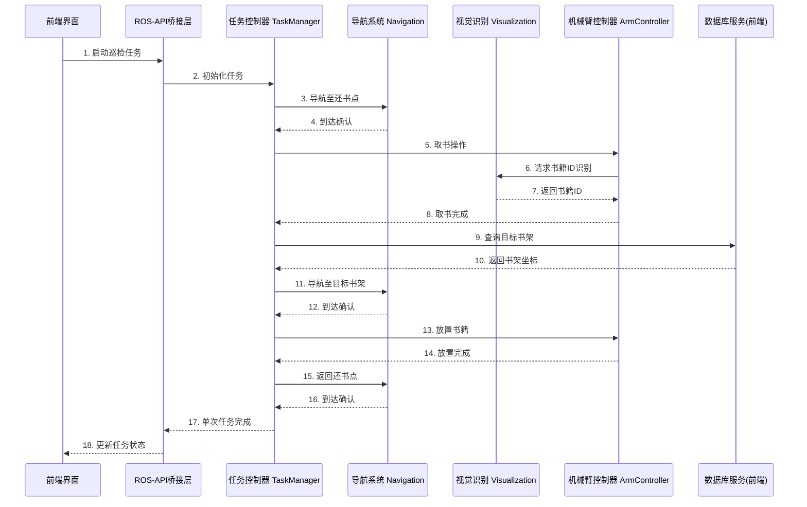
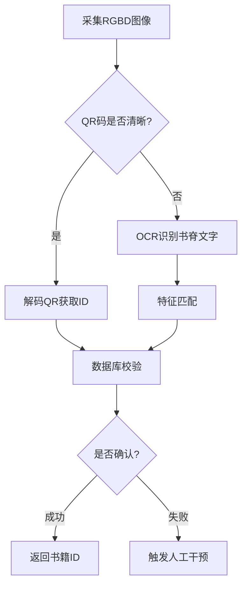

# ROS后端设计草稿

## 〇、系统架构

### ROS后端



一般数据流图：



一般时序关系：



## 一、自动建图

### 0. `explore_lite`的安装

一般`explore-lite`包并不默认自带，需要自行安装：

```bash
sudo apt install ros-noetic-explore-lite
```

---

### 1. **交互流程架构**


---

### 2. **关键交互接口**
#### **(1) 前端 → ROS 后端**
| 指令类型       | ROS 接口                  | 实现方式                          | 示例代码                          |
|----------------|---------------------------|-----------------------------------|-----------------------------------|
| **启动探索**   | `/mapping/start`服务   | 调用launch文件或启动节点          | `roslaunch my_robot explore.launch` |
| **停止探索**   | `/mapping/frontiers`服务      | 发布空边界消息                    | 见下文Python示例                  |
| **设置参数**   | `rosparam`                | 动态修改参数                      | `rosparam set /explore/min_frontier_size 0.5` |

#### **(2) ROS 后端 → 前端**
| 数据类型       | ROS 话题/服务             | 用途                              |
|----------------|---------------------------|-----------------------------------|
| **地图数据**   | `/map` (OccupancyGrid)    | 实时显示SLAM地图                  |
| **边界信息**   | `/explore/frontiers`      | 可视化探索边界（GridCells格式）   |
| **机器人位姿** | `/amcl_pose` 或 `/tf`     | 显示机器人位置                    |
| **探索状态**   | `/move_base/status`       | 检测是否卡住或完成                |

---

### 3. **实现代码示例**
#### **(1) 前端通过HTTP与ROS交互（Python Flask + ROSBridge）**
```python
# backend_ros_api.py
from flask import Flask, jsonify
import rospy
from std_msgs.msg import Empty
from geometry_msgs.msg import PoseStamped

app = Flask(__name__)
rospy.init_node('frontend_ros_bridge')

# 启动探索服务
@app.route('/start_explore', methods=['POST'])
def start_explore():
    os.system("roslaunch explore_lite explore.launch &")
    return jsonify({"status": "exploration started"})

# 停止探索服务
@app.route('/stop_explore', methods=['POST'])
def stop_explore():
    pub = rospy.Publisher('/explore/frontiers', GridCells, queue_size=1)
    pub.publish(GridCells())  # 发布空边界强制停止
    return jsonify({"status": "exploration stopped"})

if __name__ == '__main__':
    app.run(host='0.0.0.0', port=5000)
```

#### **(2) 前端通过WebSocket实时获取地图（ROSBridge + Web）**
```html
<!-- frontend.html -->
<script>
    const ros = new ROSLIB.Ros({ url: 'ws://localhost:9090' });
    
    // 订阅地图话题
    const mapSub = new ROSLIB.Topic({
        ros: ros,
        name: '/map',
        messageType: 'nav_msgs/OccupancyGrid'
    });
    
    mapSub.subscribe((mapMsg) => {
        // 使用leaflet或three.js渲染地图
        console.log(mapMsg.info.width, mapMsg.info.height);
    });
    
    // 发送探索指令
    function startExplore() {
        fetch('http://localhost:5000/start_explore', { method: 'POST' });
    }
</script>
```

---

### 4. **安全性与错误处理**
#### **(1) 超时监控**
```python
# 监控探索超时（例如10分钟无新边界）
def check_timeout():
    last_boundary_time = rospy.Time.now()
    def frontier_cb(msg):
        nonlocal last_boundary_time
        if len(msg.cells) > 0:
            last_boundary_time = rospy.Time.now()
    
    rospy.Subscriber('/explore/frontiers', GridCells, frontier_cb)
    while not rospy.is_shutdown():
        if (rospy.Time.now() - last_boundary_time).to_sec() > 600:
            os.system("rosnode kill /explore")
            break
        rospy.sleep(1)
```

#### **(2) 异常状态检测**
```bash
# 检测move_base故障状态
rostopic echo /move_base/status | grep "status: 4"  # ABORTED状态
```

#### **(3) 因障碍物而暂停时的恢复**

此代码示例在`src\realbot_demo\scripts\auto_mapping_recover.py`中。

```python
import rospy
from std_msgs.msg import Bool
from geometry_msgs.msg import Twist

class CollisionRecovery:
    """
    碰撞恢复类，实现在碰撞后自动后退和旋转，随后重新构建地图
    """
    def __init__(self):
        self.cmd_pub = rospy.Publisher('/cmd_vel', Twist, queue_size=1)
        rospy.Subscriber('/collision_status', Bool, self.collision_cb)
        self.collision = False

    def collision_cb(self, msg):
        self.collision = msg.data
        if self.collision:
            self.recover()

    def recover(self):
        # 1. 后退
        back_cmd = Twist()
        back_cmd.linear.x = -0.2
        self.cmd_pub.publish(back_cmd)
        rospy.sleep(1.0)
        
        # 2. 小角度旋转
        rotate_cmd = Twist()
        rotate_cmd.angular.z = 0.5
        self.cmd_pub.publish(rotate_cmd)
        rospy.sleep(1.5)
        
        # 3. 停止并重置
        self.cmd_pub.publish(Twist())
        os.system("rosservice call /move_base/clear_costmaps")

if __name__ == '__main__':
    rospy.init_node('collision_recovery')
    cr = CollisionRecovery()
    rospy.spin()
```

---

## 二、导航引导

#### **1. 系统架构设计**


---

#### **2. 核心交互接口定义**

##### **2.1 前端 → ROS后端**
| 功能               | ROS接口类型          | 数据结构                    | ROS接口|示例调用方式                 |
|--------------------|----------------------|----------------------------|---|------------------------------|
| 设置导航目标       | Service   | MoveBaseActionGoal         | `navigation/navigation`服务 |点击地图发送(x,y,θ)          |
| 取消当前导航       | Service              | move_base/cancel           | `navigation/abort`服务 |点击取消按钮                 |
| 设置导航参数       | Dynamic Reconfigure  | move_base/参数组           | (在调用`navigation/navigation`动作时设置) |调整最大速度等参数           |
| 加载指定地图       | Service (map_server) | nav_msgs/LoadMap           | `navigation/map`服务 |切换楼层地图                 |

##### **2.2 ROS后端 → 前端**
| 数据类型            | ROS接口               | 更新频率 | 用途                         |
|---------------------|-----------------------|----------|------------------------------|
| 机器人实时位姿      | /amcl_pose (PoseWithCovarianceStamped) | 10Hz    | 在地图上显示机器人位置       |
| 全局路径规划结果    | /move_base/NavfnROS/plan (Path)       | 按需     | 显示蓝色路径线               |
| 局部轨迹规划        | /move_base/DWAPlannerROS/local_plan (Path) | 5Hz    | 显示绿色局部轨迹             |
| 导航状态反馈        | /move_base/feedback (MoveBaseActionFeedback) | 1Hz    | 显示"正在绕过障碍物"等状态   |
| 代价地图可视化      | /move_base/global_costmap/costmap (OccupancyGrid) | 1Hz    | 显示红色禁区区域             |

---

#### **3. 关键实现代码示例**

##### **3.1 前端导航指令发送(JavaScript+ROSLIB)**
```javascript
// 初始化ROS连接
const ros = new ROSLIB.Ros({ url: 'ws://robot_ip:9090' });

// 创建导航目标Action客户端
const navClient = new ROSLIB.ActionClient({
  ros: ros,
  serverName: '/move_base',
  actionName: 'move_base_msgs/MoveBaseAction'
});

// 发送目标点
function sendGoal(x, y, theta) {
  const goal = new ROSLIB.Goal({
    actionClient: navClient,
    goalMessage: {
      target_pose: {
        header: { frame_id: 'map' },
        pose: {
          position: { x: x, y: y },
          orientation: new ROSLIB.Quaternion().fromAxisAngle([0,0,1], theta)
        }
      }
    }
  });
  
  // 注册反馈回调
  goal.on('feedback', (f) => {
    console.log(`剩余距离: ${f.feedback.base_position.distance}米`);
  });
  
  // 注册结果回调
  goal.on('result', (res) => {
    if(res.status.status === 3) alert("到达目的地!");
    else alert(`导航失败: ${res.status.text}`);
  });
  
  goal.send();
}

// 示例：发送目标到(2.5, 3.0)方向朝东
sendGoal(2.5, 3.0, Math.PI/2);
```

##### **3.2 后端导航状态监控(Python)**
```python
class NavMonitor:
    def __init__(self):
        self.current_task = None
        rospy.Subscriber('/move_base/status', GoalStatusArray, self.status_cb)
        rospy.Subscriber('/move_base/current_goal', PoseStamped, self.goal_cb)
        
    def status_cb(self, msg):
        if msg.status_list:
            status = msg.status_list[-1]
            if status.status == 1:  # ACTIVE
                self.publish_web('NAV_PROGRESS', f'行进中，剩余距离: {self.calc_remaining_dist()}m')
            elif status.status == 3:  # SUCCEEDED
                self.publish_web('NAV_RESULT', {'success': True})
            elif status.status == 4:  # ABORTED
                error_msg = self.parse_error(status.text)
                self.publish_web('NAV_RESULT', {'success': False, 'reason': error_msg})
    
    def calc_remaining_dist(self):
        try:
            current_pose = rospy.wait_for_message('/amcl_pose', PoseWithCovarianceStamped, timeout=1)
            goal_pose = rospy.wait_for_message('/move_base/current_goal', PoseStamped, timeout=1)
            dx = goal_pose.pose.position.x - current_pose.pose.pose.position.x
            dy = goal_pose.pose.position.y - current_pose.pose.pose.position.y
            return round(math.hypot(dx, dy), 2)
        except:
            return 0.0

    def publish_web(self, msg_type, data):
        # 通过WebSocket或HTTP推送状态到前端
        pass
```

---

#### **4. 异常处理机制设计**

##### **4.1 导航失败分类处理**
| 错误类型            | 检测方式                          | 前端响应策略                   |
|---------------------|-----------------------------------|------------------------------|
| 目标不可达          | /move_base/status返回ABORTED      | 显示红色警告，建议调整目标点   |
| 长时间路径规划失败  | 监控全局规划超时(>10秒)           | 重新路径规划       |
| 动态障碍物阻挡      | 局部代价地图突然变化              | 显示黄色警示，启动自动避障     |

##### **4.2 自动避障代码示例**

完整代码示例在`src\navigation\scripts\simple_goal.py`中。

```python
# 监听进度，实现动态避障
def obstacle_detect(self, msg):
    if (self.reach_flag == False and msg.ranges[180] < 0.5):
        self.renavigate()
        rospy.sleep(1)

rospy.init_node("simple_goal")  
radar_obstacle_detect = rospy.Subscriber("scan", LaserScan, self.obstacle_detect)
rospy.spin()
```

---

#### **5. 前端界面要素设计示例**
```html
<div class="nav-interface">
    <!-- 地图显示区 -->
    <div id="map-container">
        <canvas id="map-layer"></canvas>
        <canvas id="robot-layer"></canvas>
        <canvas id="path-layer"></canvas>
    </div>
    
    <!-- 控制面板 -->
    <div class="control-panel">
        <button @click="setGoalMode">设置目标</button>
        <button @click="cancelNav">紧急停止</button>
        <div class="status-indicator" :class="navStatus">
            {{ statusText }}
        </div>
        <div class="param-adjust">
            <slider v-model="maxSpeed" min="0.2" max="1.0" @change="updateSpeed"/>
        </div>
    </div>
</div>
```

#### **6. 性能优化策略**
1. **数据压缩传输**：对地图数据采用`PNG`编码压缩（通过`map_to_image`节点）
2. **差分更新**：仅传输路径/位置的变化部分而非全量数据
3. **带宽自适应**：根据网络质量动态调整传输频率：
   ```javascript
   // 动态调整话题频率
   function adjustPublishRate(baseRate) {
     const netQuality = checkNetwork();
     const actualRate = netQuality === 'good' ? baseRate : Math.floor(baseRate/2);
     $(".topic-config").each(() => {
       this.throttleRate = actualRate;
     });
   }
   ```

---

#### **7. 安全审计要点**
1. **目标点合法性校验**：
   ```python
   def validate_goal(pose):
       # 检查是否在可通行区域
       cost = get_costmap_value(pose.x, pose.y)
       return cost < 50  # 50为代价阈值
   ```
2. **速度限制防护**：
   ```yaml
   # move_base参数配置
   controller:
     max_vel_x: 0.8
     min_vel_x: -0.2
     acc_lim_x: 0.5
   ```
3. **操作权限分级**：
   ```json
   {
     "user_level": 2,
     "allowed_actions": ["set_goal", "pause"],
     "denied_actions": ["parameter_change"]
   }
   ```

---

该方案通过多层次的状态监控、智能恢复策略和优化的数据传输机制，可构建高效可靠的导航交互系统。建议配合导航日志分析工具（如`rosbag`+`rqt_plot`）进行持续优化。

---

## 三、书籍搬运

#### **1. 系统架构设计**


---

#### **2. 核心交互接口定义**

##### **2.1 数据库结构设计**
| 表名           | 字段                     | 示例值                 |
|----------------|--------------------------|-----------------------|
| book_info      | id(PK), title, isbn      | 1001, "ROS指南", 9787... |
| shelf_location | book_id(FK), x, y, theta | 1001, 3.5, 2.1, 0.0   |
| target_location| book_id(FK), x, y        | 1001, 5.2, 4.8        |

##### **2.2 ROS服务接口**
| 服务名称                | 服务类型                      | 功能描述                   |
|-------------------------|-------------------------------|---------------------------|
| /arm_control            | `book_fetch/fetch`  | 机械臂抓取指定物品 |
| /vision_identify        | `/book_identify`  | 请求视觉识别，根据书籍编号的匹配判断需要抓取哪本书籍               |

##### **2.3 ROS话题接口**
| 话题名称                | 消息类型                   | 用途                     |
|-------------------------|---------------------------|--------------------------|
| `/book_scan_result`       | String                    | 实时传输扫描到的书籍ID    |
| `/task_progress`       | UInt8                     | 任务阶段进度百分比        |

---

#### **3. 关键模块实现示例**

##### **3.1 视觉识别节点(Python)**
```python
class BookDetector:
    def __init__(self):
        self.bridge = CvBridge()
        self.detector = cv2.QRCodeDetector()
        rospy.Service('/vision_identify', BookDetect, self.handle_detect)
        
    def handle_detect(self, req):
        cv_image = self.bridge.imgmsg_to_cv2(req.image, "bgr8")
        decoded, points = self.detector.detectAndDecode(cv_image)
        if decoded:
            return BookDetectResponse(success=True, book_id=decoded)
        else:
            return BookDetectResponse(success=False)

# 订阅摄像头话题
rospy.Subscriber("/camera/rgb/image_raw", Image, image_callback)
```

##### **3.2 机械臂控制节点(C++)**
```cpp
class ArmController {
public:
    ArmController() : arm_group("manipulator"), gripper_group("gripper") {
        arm_group.setPlannerId("RRTConnectkConfigDefault");
        gripper_group.setNamedTarget("open");
        gripper_group.move();
    }

    bool executeCommand(book_manipulation::ArmCommand::Request &req,
                       book_manipulation::ArmCommand::Response &res) {
        if(req.command == "scan") {
            performScanning();
        } else if(req.command == "grab") {
            approachBook(req.x, req.y);
            closeGripper();
        }
        res.success = true;
        return true;
    }

private:
    void performScanning() {
        std::vector<geometry_msgs::Pose> waypoints;
        // 生成扫描轨迹
        for(int i=0; i<5; i++){
            geometry_msgs::Pose pose;
            pose.position.z = 0.3 + i*0.05;
            waypoints.push_back(pose);
        }
        moveit_msgs::RobotTrajectory trajectory;
        arm_group.computeCartesianPath(waypoints, 0.01, 0.0, trajectory);
        arm_group.execute(trajectory);
    }
};
```

---

#### **4. 任务状态机设计**


---

#### **5. 异常处理机制**

##### **5.1 常见故障处理策略**
| 故障类型           | 检测方法                          | 恢复策略                     |
|--------------------|-----------------------------------|------------------------------|
| 视觉识别失败       | 扫描后5秒内无结果                | 重新扫描     |
| 书籍抓取失败       | 多次扫描后仍无结果             | 向前端报错并暂停任务           |
| 路径规划失败       | move_base返回ABORTED状态         | 切换为人工遥控模式           |
| 书籍错位           | 视觉校验与数据库ID不匹配         | 触发报警并暂停任务           |

##### **5.2 安全监控模块示例**
```python
class SafetyMonitor:
    def __init__(self):
        self.emergency_stop = False
        rospy.Subscriber("/safety_zone", Bool, self.zone_cb)
        rospy.Subscriber("/emergency_stop", Bool, self.estop_cb)
        
    def zone_cb(self, msg):
        if not msg.data and self.arm_moving():
            self.pause_arm()
            
    def estop_cb(self, msg):
        if msg.data:
            self.emergency_stop = True
            rospy.logerr("!!! 急停触发 !!!")
            self.stop_all_motion()
```

---

#### **6. 前端界面设计示例**
```html
<div class="book-task-interface">
    <!-- 任务控制区 -->
    <div class="task-control">
        <input v-model="bookId" placeholder="输入书籍ID">
        <button @click="startTask">开始搬运</button>
        <button @click="emergencyStop" class="danger">急停</button>
    </div>

    <!-- 状态显示区 -->
    <div class="status-panel">
        <div class="progress-bar" :style="{width: progress + '%'}"></div>
        <div class="state-indicator">
            当前状态: {{ stateText }}
            <span v-if="currentBookId">正在处理: {{ currentBookId }}</span>
        </div>
        <div class="camera-view">
            
            <div class="qr-overlay" v-if="detectedQr">{{ detectedQr }}</div>
        </div>
    </div>

    <!-- 日志区 -->
    <div class="log-container">
        <div v-for="log in logs" :class="log.type">
            [{{ log.time }}] {{ log.message }}
        </div>
    </div>
</div>
```

---

#### **7. 性能优化策略**

##### **7.1 路径规划优化**
```yaml
# 导航参数优化
DWAPlannerROS:
  sim_time: 3.0
  path_distance_bias: 32.0
  goal_distance_bias: 24.0
  occdist_scale: 0.1
```

##### **7.2 视觉识别加速**
```python
# 使用多线程处理图像
from concurrent.futures import ThreadPoolExecutor

class VisionProcessor:
    def __init__(self):
        self.executor = ThreadPoolExecutor(max_workers=4)
        
    def async_detect(self, image_msg):
        future = self.executor.submit(self.detect_task, image_msg)
        future.add_done_callback(self.result_callback)
```

##### **7.3 数据库缓存机制**
```cpp
// 使用LRU缓存近期查询结果
const int CACHE_SIZE = 50;
std::map<std::string, LocationData> locationCache;

LocationData queryFromCache(string bookId) {
    if(locationCache.count(bookId)){
        return locationCache[bookId];
    } else {
        auto data = dbClient.query(bookId);
        if(locationCache.size() >= CACHE_SIZE) {
            locationCache.erase(locationCache.begin());
        }
        locationCache[bookId] = data;
        return data;
    }
}
```

---

#### **8. 系统验证方案**

##### **8.1 功能测试用例**
```gherkin
Scenario: 完整书籍搬运流程
  Given 数据库中存在ID为1001的书籍记录
  When 前端提交搬运1001的请求
  Then 机器人应依次完成：
    | 步骤               | 预期结果                 |
    | 到达A3书架          | 误差<0.1m               |
    | 识别到1001书籍      | 扫描时间<5秒            |
    | 成功抓取书籍        | 力传感器反馈正常        |
    | 到达B2目标位置      | 导航路径避开障碍        |
    | 正确放置书籍        | 视觉校验确认位置        |
    | 返回充电桩          | 电量消耗<1%           |
```

##### **8.2 性能指标**
| 指标项               | 要求值              |
|----------------------|--------------------|
| 单次任务最长时间     | <5分钟            |
| 书籍识别准确率       | ≥99%              |
| 机械臂抓取成功率     | ≥95%              |
| 导航路径规划时间     | <3秒              |
| 系统恢复时间(急停后) | <10秒             |

---

#### **9. 部署注意事项**
1. **环境校准**：
   - 使用`tf2`工具校准机械臂与底盘坐标系
   - 定期运行`rosrun camera_calibration cameracalibrator.py`进行相机标定

2. **安全配置**：
   ```xml
   <!-- 在URDF中添加安全区域 -->
   <safety_controller>
     <soft_lower_limit value="0.0"/>
     <soft_upper_limit value="0.2"/>
     <k_position value="20.0"/>
     <k_velocity value="50.0"/>
   </safety_controller>
   ```

3. **日志管理**：
   ```bash
   # 自动归档任务日志
   roslaunch book_manipulation task_control.launch log_dir:=$(date +%Y%m%d)
   ```

---

该方案通过模块化设计实现书籍搬运的全流程自动化，结合精确的状态管理和多重安全机制，可满足图书馆、仓储等场景的智能化搬运需求。建议配合ROS诊断工具(`rqt_robot_monitor`)进行实时健康监测。

---

## 四、书架巡检

#### **1. 系统架构设计**


---

#### **2. 核心交互接口定义**

##### **2.1 数据库扩展设计参考**
| 表名           | 新增字段                 | 说明                          |
|----------------|--------------------------|------------------------------|
| return_station | station_id, x, y, theta  | 还书点位置信息(支持多还书点)  |
| book_location  | last_return_time         | 记录最近归还时间              |

##### **2.2 新增ROS服务接口**
| 服务名称                | 服务类型                      | 功能描述                   |
|-------------------------|-------------------------------|---------------------------|
| /get_next_book          | `book_inspection/GetNextBook`   | 获取还书点待处理书籍       |
| /shelf_verify           | `book_inspection/ShelfCheck`    | 书架空位校验服务           |

##### **2.3 新增ROS话题**
| 话题名称                | 消息类型                   | 用途                     |
|-------------------------|---------------------------|--------------------------|
| /return_station_status  | `book_inspection/StationStatus` | 还书点书籍存在检测        |

---

#### **3. 任务控制模块设计**

##### **3.1 多还书点调度算法**
```python
class ReturnStationScheduler:
    def __init__(self):
        self.stations = rospy.get_param('/return_stations')
        
    def select_optimal_station(self):
        # 基于距离和负载的决策
        current_pose = self.get_robot_pose()
        min_cost = float('inf')
        selected = None
        
        for station in self.stations:
            # 计算导航代价
            dist_cost = self.calc_distance_cost(current_pose, station)
            # 获取待处理书籍数量
            load_cost = self.get_station_load(station['id'])
            # 综合代价函数
            total_cost = 0.6*dist_cost + 0.4*load_cost
            
            if total_cost < min_cost:
                min_cost = total_cost
                selected = station
                
        return selected
```

##### **3.2 书架放置校验逻辑**
```cpp
bool ShelfChecker::verifyPlacement(int shelf_id, int layer){
    // 获取书架当前占用状态
    auto occupancy = db_client.queryShelfOccupancy(shelf_id);
    
    // 寻找第一个空位
    for(int i=0; i<MAX_LAYERS; i++){
        if(!(occupancy & (1<<(layer*4 + i%4))){
            target_pos = calcPosition(shelf_id, layer, i%4);
            return true;
        }
    }
    return false;
}
```

---

#### **4. 视觉识别增强方案**

##### **4.1 多模态识别流程**


##### **4.2 深度学习集成**
```python
class BookIdentifier:
    def __init__(self):
        # 加载预训练模型
        self.qr_model = load_model('qr_detector.h5')
        self.ocr_model = load_model('book_spine_ocr.h5')
        
    def identify_book(self, image):
        # 第一步：QR码检测
        qr_roi = self.qr_model.detect(image)
        if qr_roi:
            return decode_qr(qr_roi)
            
        # 第二步：书脊文字识别
        text_region = self.ocr_model.segment(image)
        return self.ocr_model.recognize(text_region)
```

---

#### **5. 异常处理与恢复**

##### **5.1 典型故障处理策略**
| 故障场景            | 检测方法                  | 恢复策略                     |
|---------------------|---------------------------|------------------------------|
| 还书点无书籍        | 视觉连续3次检测失败       | 标记为已完成，转至下一还书点 |
| 书架满载            | 位姿校验服务返回失败      | 暂存至临时区域并触发警报     |
| 书籍ID无法识别      | 多模态识别均失败          | 转入人工处理队列             |
| 多次放置失败        | 力传感器异常波动          | 重新扫描书架结构             |

##### **5.2 状态回滚机制**
```python
class TransactionManager:
    def __init__(self):
        self.transaction_stack = []
        
    def begin_transaction(self):
        self.transaction_stack.append({
            'position': get_robot_pose(),
            'arm_state': arm.get_current_state(),
            'book_held': current_book_id
        })
        
    def rollback(self):
        if self.transaction_stack:
            state = self.transaction_stack.pop()
            # 回退到上一个安全状态
            nav.go_to(state['position'])
            arm.recover_state(state['arm_state'])
            if state['book_held']:
                handle_book_rollback(state['book_held'])
```

---

#### **6. 前端监控界面设计**

##### **6.1 主要功能区块**
```html
<div class="inspection-interface">
    <!-- 还书点状态看板 -->
    <div class="station-panel">
        <div v-for="station in returnStations" 
             :class="['station', {active: station.hasBooks}]">
            {{ station.id }}: {{ station.queuedBooks }}本待处理
        </div>
    </div>
    
    <!-- 实时三维可视化 -->
    <div class="3d-viewer">
        <robot-model :pose="currentPose"/>
        <book-model v-for="book in carriedBooks" :position="book.position"/>
    </div>
    
    <!-- 任务统计 -->
    <div class="stats">
        <div>已完成: {{ completedCount }}</div>
        <div>异常: {{ errorCount }}</div>
        <div>当前书籍: {{ currentBook || '无' }}</div>
    </div>
</div>
```

##### **6.2 数据可视化方案**
```javascript
// 使用Three.js渲染书架状态
function renderShelfOccupancy(shelfData) {
    shelfData.forEach(shelf => {
        const geometry = new THREE.BoxGeometry(0.3, 0.2, 0.05);
        shelf.layers.forEach((layer, idx) => {
            const material = new THREE.MeshBasicMaterial({
                color: layer.occupied ? 0xff0000 : 0x00ff00
            });
            const cube = new THREE.Mesh(geometry, material);
            cube.position.set(shelf.x, shelf.y + idx*0.25, 0);
            scene.add(cube);
        });
    });
}
```

---

#### **7. 系统优化策略**

##### **7.1 路径规划优化**
```yaml
# 多目标点TSP优化配置
global_planner:
  use_tsp_solver: true
  tsp_heuristic: simulated_annealing
  max_stations_per_cycle: 8
```

##### **7.2 数据库查询优化**
```sql
-- 建立复合索引加速查询
CREATE INDEX idx_book_status ON book_location 
(book_id, status, shelf_id) INCLUDE (x, y);
```

##### **7.3 机械臂轨迹缓存**
```cpp
// 预计算常用轨迹
void ArmController::precomputeTrajectories() {
    precomputed["return_pick"] = computeTrajectory(home_pose, return_pick_pose);
    precomputed["shelf_place"] = computeTrajectory(home_pose, shelf_place_pose);
}
```

---

#### **8. 系统验证方案**

##### **8.1 测试用例矩阵**
| 测试维度         | 测试场景                  | 预期结果               |
|------------------|--------------------------|-----------------------|
| 正常流程         | 单本书正确识别放置        | 完成时间<3分钟        |
| 异常处理         | 还书点空置检测            | 10秒内转至下一站点    |
| 性能压力         | 连续处理50本书籍          | 无内存泄漏，成功率>98%|
| 故障恢复         | 人为中断后继续任务        | 状态恢复误差<5cm      |

##### **8.2 验收指标**
| 指标类别         | 项目                   | 标准值             |
|------------------|------------------------|-------------------|
| 功能性指标       | 书籍识别准确率         | ≥99.5%            |
|                  | 放置位置精度           | ±2cm              |
| 时效性指标       | 单本书平均处理时间     | ≤150秒            |
|                  | 系统响应延迟           | <500ms            |
| 可靠性指标       | 连续运行故障间隔       | ≥72小时           |
|                  | 急停恢复时间           | ≤8秒              |

---

#### **9. 部署实施要点**

##### **9.1 环境配置**
1. **还书点标定**：
   ```bash
   rosrun tf2_ros static_transform_publisher x y z yaw pitch roll frame_id child_frame_id
   ```
2. **书架坐标系对齐**：
   ```python
   # 使用AR标签辅助校准
   aruco_dict = cv2.aruco.Dictionary_get(cv2.aruco.DICT_6X6_250)
   corners, ids = cv2.aruco.detectMarkers(image, aruco_dict)
   ```

##### **9.2 安全规范**
1. **操作区域隔离**：
   ```xml
   <!-- 在URDF中定义安全区 -->
   <safety_controller>
     <soft_upper_limit value="0.25"/>  <!-- 还书点工作区限位 -->
     <k_velocity value="30.0"/>
   </safety_controller>
   ```
2. **紧急避让策略**：
   ```python
   def human_avoidance():
       while True:
           if lidar.detect_human() and arm.is_moving():
               arm.pause()
               nav.move_away()
               sound.play_warning()
   ```

---

该方案通过智能调度算法、多级容错机制和优化的人机交互设计，可实现高效可靠的书架巡检作业。建议配合ROS诊断工具链(`rqt_console`+`rosbag`)进行持续性能优化，同时定期使用`moveit_calibration`进行机械臂精度校准。
