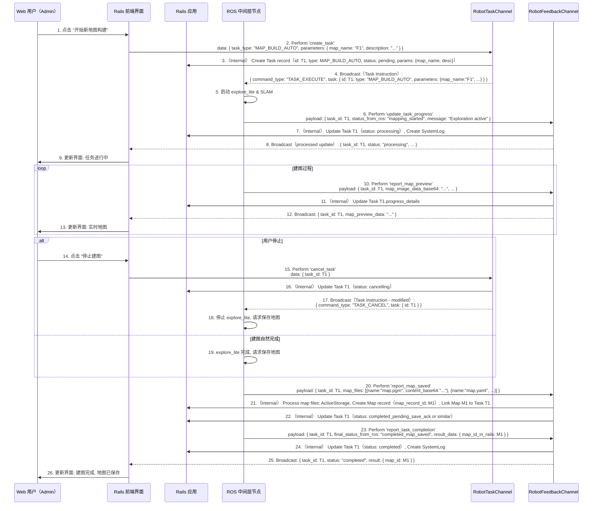
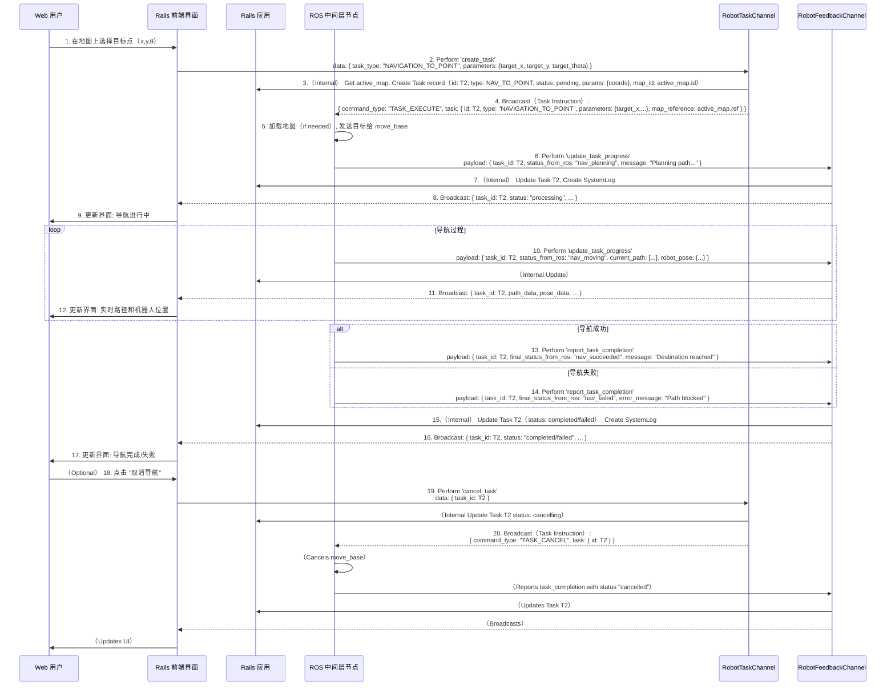
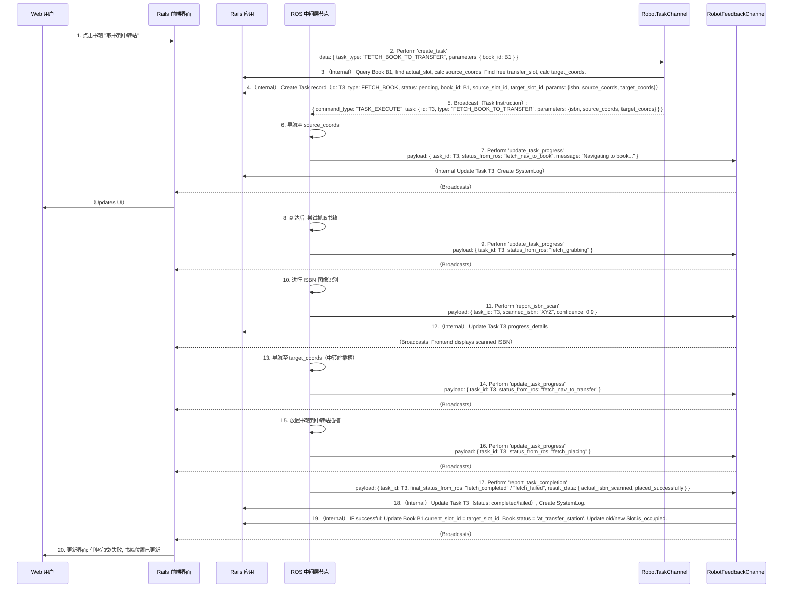
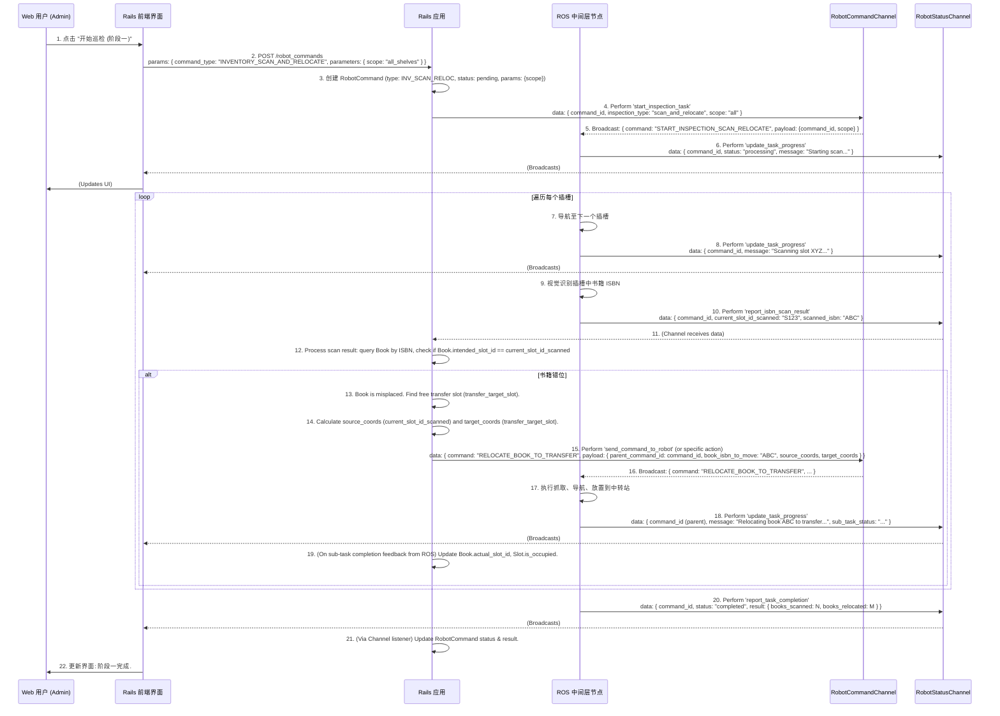
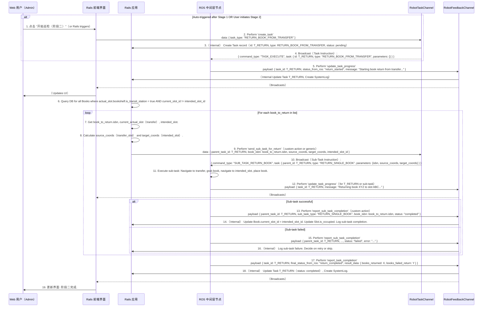

# Rails Web端详细设计 （迭代中）

## 1. 统一通信规范与方法

本节定义 Rails 应用与 ROS 中间层节点之间通过 Action Cable 进行通信的基本规范和数据结构。

### 1.1. Action Cable Channels

*   **`RobotTaskChannel`（取代 `RobotCommandChannel` 的部分功能，专注于任务指令）:**
    *   **用途:** 前端发起任务 -> Rails 创建 `Task` 记录 -> Rails 通过此 Channel 向 ROS 发送任务指令。
    *   **Rails 端（由前端调用，触发任务创建和指令发送）:**
        *   `perform(action_name, data）`: 前端调用，如 `perform('create_mapping_task', { map_name: "..." }）`。
        *   Rails 内部逻辑：
            1.  验证用户权限。
            2.  校验 `data` 参数。
            3.  创建 `Task` 记录（e.g., `Task.create(type: 'MAP_BUILD_AUTO', user: current_user, parameters: data, status: 'pending'）`）。
            4.  向 ROS 广播任务指令（见 1.2.1）。
    *   **ROS 端:** 订阅此 Channel，接收任务指令。

*   **`RobotControlChannel`（用于非任务性的、即时控制指令）:**
    *   **用途:** 前端发送简单的、即时的控制指令（如手动移动、急停、摄像头开关）。
    *   **Rails 端（由前端调用，直接广播给 ROS）:**
        *   `move(data）`: `{ direction, speed }`
        *   `stop_motion(data）`: `{}`（停止当前移动）
        *   `emergency_stop(data）`: `{}`
        *   `toggle_camera_stream(data）`: `{ enable: true/false }`
    *   **ROS 端:** 订阅此 Channel，接收并执行这些即时控制。

*   **`RobotFeedbackChannel`（取代 `RobotStatusChannel` 的部分功能，专注于任务反馈和状态）:**
    *   **用途:** ROS 节点向 Rails 发送机器人状态、任务进度、任务结果、传感器数据等。
    *   **Rails 端（由 ROS 节点调用）:**
        *   `update_robot_state(data）`: `payload: { pose: {x,y,theta}, velocity: {linear,angular}, battery_level }`
        *   `stream_camera_frame(data）`: `payload: { image_data_base64 }`
        *   `report_map_preview(data）`: `payload: { task_id, map_image_data_base64, frontiers_data }`（建图时）
        *   `report_map_saved(data）`: `payload: { task_id, map_files: [{name, content_base64_or_url}] }`（建图完成）
        *   `update_task_progress(data）`: `payload: { task_id, status_from_ros, progress_percentage, message, intermediate_results }`
        *   `report_task_completion(data）`: `payload: { task_id, final_status_from_ros, result_data, error_message }`
        *   `report_isbn_scan(data）`: `payload: { task_id（optional, if part of a task）, slot_id_scanned, scanned_isbn, confidence, image_snippet_url }`
    *   **ROS 端:** 调用此 Channel 的动作发送反馈。
    *   **前端:** 订阅此 Channel（或由 Rails 进一步处理后广播到特定前端 Channel），接收更新。

### 1.2. 消息结构约定

#### 1.2.1. Rails -> ROS（通过 `RobotTaskChannel` 或 `RobotControlChannel`）

*   **任务指令（从 `RobotTaskChannel` 广播）:**
    ```json
    {
      "command_type": "TASK_EXECUTE", // 固定类型，表明是任务执行请求
      "task": {
        "id": 123, // Task ID from Rails DB
        "type": "MAP_BUILD_AUTO", // Task type（e.g., from Tasks.type enum）
        "parameters": { // Task-specific parameters
          "map_name": "Floor1_North",
          // ... other params like target_coords, book_isbn, etc.
        },
        "map_reference": "active_map_storage_key_or_url" // Optional, for tasks needing a map
      }
    }
    ```
*   **即时控制指令（从 `RobotControlChannel` 广播）:**
    ```json
    {
      "command_type": "MOVE", // e.g., MOVE, EMERGENCY_STOP, TOGGLE_CAMERA
      "payload": {
        "direction": "forward",
        "speed": 0.5
        // ... other params for specific command_type
      }
    }
    ```

#### 1.2.2. ROS -> Rails（通过 `RobotFeedbackChannel`）

所有发送到 `RobotFeedbackChannel` 的消息，其 `data` 参数（即 Channel 动作的参数） 结构如下：

```json
// Example for update_task_progress
{
  "action": "update_task_progress", // Rails Channel 动作名
  "payload": {
    "task_id": 123, // Corresponds to Task.id in Rails
    "status_from_ros": "processing_navigation", // Detailed status from ROS
    "progress_percentage": 50,
    "message": "Navigating to target...",
    "intermediate_results": { /* task-specific intermediate data */ }
  }
}
```

### 1.3. Rails 端处理模式（for `RobotFeedbackChannel`）

当 `RobotFeedbackChannel` 收到来自 ROS 的消息时：

1.  **Authentication:** 确保消息来自已认证的 ROS 客户端（`connection.robot_client`）.
2.  **Find Task（if `task_id` present）:** `Task.find_by(id: payload[:task_id]）`.
3.  **Update Task Record:** 根据 `payload` 内容更新 `Task` 记录的 `status`, `progress_details`, `result_data`, `started_at`, `completed_at` 等字段。
    *   `status_from_ros` 可能需要映射到 Rails `Tasks.status` 枚举值。
4.  **Database Updates（if applicable）:**
    *   例如，`report_task_completion` for `FETCH_BOOK_TO_TRANSFER` 成功时，更新 `Book.current_slot_id` 和 `Slot.is_occupied`。
    *   例如，`report_map_saved` 时，创建 `Map` 记录并关联到 `Task`。
5.  **System Log:** 创建 `SystemLog` 记录，关联 `task_id`, `user_id`（from Task）, `message`（from payload or generated）, `severity`, `log_type`（'task', 'robot'）.
6.  **Broadcast to Frontend:** 将处理后的信息（或原始 `payload` 的一部分） 广播给订阅了相关信息的前端用户。这可能通过一个新的、专门面向前端的 Channel（e.g., `UserNotificationsChannel`） 或直接在 `RobotFeedbackChannel` 上进行（如果前端也订阅它并能区分消息来源）。

---


## 2. 自动建图 

### 2.1. 功能概述（同上）

管理员用户通过 Web 界面发起自动建图任务，实时监控建图过程，并在完成后保存和管理地图。

### 2.2. 前端界面关键元素（同上）

- 地图管理页面（列出已有地图，状态，操作按钮）。
- "急停"、"开始新地图构建" 按钮。
- 建图任务表单（地图名称, 描述）。
- 建图监控区域:
    - 实时 SLAM 地图显示。
    - 机器人位姿显示。
    - 任务状态文本（探索中, 完成中, 失败等）。
    - "停止建图" 按钮。

### 2.3. Rails 端核心模型与控制器

*   **模型:** `Map`, `Task`（type: `MAP_BUILD_AUTO`）, `User`
*   **控制器:** `MapsController`, `TasksController`
*   **Action Cable Channels:** `RobotTaskChannel`, `RobotFeedbackChannel`

### 2.4. 详细流程图



### 2.5. 关键接口表（调整）

| 操作             | 触发方 | 目标方        | Channel & Action / HTTP Endpoint              | 数据示例（Payload/Params）                                   |
| ---------------- | ------ | ------------- | --------------------------------------------- | ------------------------------------------------------------ |
| **开始建图任务** | 前端   | Rails（Chan） | `RobotTaskChannel#create_task`                | `{ task_type: "MAP_BUILD_AUTO", parameters: { map_name: "Floor1", description: "..." } }` |
| *(Rails->ROS）*  | Rails  | ROS（Chan）   | (Broadcast from `RobotTaskChannel`）          | `{ command_type: "TASK_EXECUTE", task: { id: T1, type: "MAP_BUILD_AUTO", parameters: {...} } }` |
| **任务进度**     | ROS    | Rails（Chan） | `RobotFeedbackChannel#update_task_progress`   | `{ task_id: T1, status_from_ros: "mapping_active", message: "..." }` |
| **地图预览**     | ROS    | Rails（Chan） | `RobotFeedbackChannel#report_map_preview`     | `{ task_id: T1, map_image_data_base64: "...", ... }`         |
| **停止建图任务** | 前端   | Rails（Chan） | `RobotTaskChannel#cancel_task`                | `{ task_id: T1 }`                                            |
| *(Rails->ROS）*  | Rails  | ROS（Chan）   | (Broadcast from `RobotTaskChannel`）          | `{ command_type: "TASK_CANCEL", task: { id: T1 } }`          |
| **地图保存上报** | ROS    | Rails（Chan） | `RobotFeedbackChannel#report_map_saved`       | `{ task_id: T1, map_files: [{name:"map.pgm", content_base64:"..."}, ...] }` |
| **任务完成**     | ROS    | Rails（Chan） | `RobotFeedbackChannel#report_task_completion` | `{ task_id: T1, final_status_from_ros: "completed_map_saved", result_data: { map_id_in_rails: M1 } }` |
| **激活地图**     | 前端   | Rails（HTTP） | `PUT /maps/:id/activate`                      | (ID in URL）                                                 |
| *(Rails->ROS）*  | Rails  | ROS（Chan）   | (Broadcast from `RobotTaskChannel`）          | `{ command_type: "TASK_EXECUTE", task: { id: T_LOADMAP, type: "LOAD_MAP", parameters: { map_id_in_rails: M1, map_reference: "..." } } }` |


## 3. 导航引导 

### 3.1. 功能概述

用户在 Web 界面上选择活动地图，并在地图上指定目标点（书架），机器人自主导航至目标位置。实时显示机器人路径和状态。

### 3.2. 前端界面关键元素 

- 地图显示区域（使用当前活动地图）。
- 工具：点击地图设置导航目标点。
- 手动输入坐标功能。
- "开始导航" 按钮。
- 导航状态显示（路径、机器人位姿、状态文本）。
- "取消导航" 按钮。

### 3.3. Rails 端核心模型与控制器

*   **模型:** `Map`, `Task`（type: `NAVIGATION_TO_POINT`）, `User`
*   **控制器:** `TasksController`
*   **Action Cable Channels:** `RobotTaskChannel`, `RobotFeedbackChannel`, `RobotControlChannel`（for cancel）

### 3.4. 详细流程图



### 3.5. 关键接口表

| 操作              | 触发方 | 目标方        | Channel & Action / HTTP Endpoint              | 数据示例（Payload/Params）                                   |
| ----------------- | ------ | ------------- | --------------------------------------------- | ------------------------------------------------------------ |
| **创建导航任务**  | 前端   | Rails（Chan） | `RobotTaskChannel#create_task`                | `{ task_type: "NAVIGATION_TO_POINT", parameters: { target_x: 1.0, target_y: 2.5, target_theta: 0.0 } }` |
| *(Rails->ROS）*   | Rails  | ROS（Chan）   | (Broadcast from `RobotTaskChannel`）          | `{ command_type: "TASK_EXECUTE", task: { id: T2, type: "NAVIGATION_TO_POINT", parameters: {...}, map_reference: "..."} }` |
| **导航进度**      | ROS    | Rails（Chan） | `RobotFeedbackChannel#update_task_progress`   | `{ task_id: T2, status_from_ros: "nav_moving", message: "...", current_path: [...], robot_pose: {x,y,theta} }` |
| **导航完成/失败** | ROS    | Rails（Chan） | `RobotFeedbackChannel#report_task_completion` | `{ task_id: T2, final_status_from_ros: "nav_succeeded" / "nav_failed", message: "...", result_data: {} }` |
| **取消导航任务**  | 前端   | Rails（Chan） | `RobotTaskChannel#cancel_task`                | `{ task_id: T2 }`                                            |
| *(Rails->ROS）*   | Rails  | ROS（Chan）   | (Broadcast from `RobotTaskChannel`）          | `{ command_type: "TASK_CANCEL", task: { id: T2 } }`          |


## 4. 书籍搬运（取书到中转站） 

### 4.1. 功能概述 

用户从书籍列表中选择一本书，命令机器人将其从当前实际位置取到指定的中转站空闲插槽。

### 4.2. 前端界面关键元素

- 书籍列表（显示书名, 作者, ISBN, 当前位置）。
- 每本书旁有 "取书到中转站" 按钮。
- 任务状态区域（显示当前搬运任务的详细步骤和状态）。
- ISBN 识别结果显示。

### 4.3. Rails 端核心模型与控制器

*   **模型:** `Book`, `Slot`, `Bookshelf`, `Task`（type: `FETCH_BOOK_TO_TRANSFER`）, `User`
*   **控制器:** `BooksController` , `TasksController`
*   **Action Cable Channels:** `RobotTaskChannel`, `RobotFeedbackChannel`

### 4.4. 详细流程图



### 4.5. 关键接口表 

| 操作              | 触发方 | 目标方        | Channel & Action / HTTP Endpoint              | 数据示例（Payload/Params）                                   |
| ----------------- | ------ | ------------- | --------------------------------------------- | ------------------------------------------------------------ |
| **创建取书任务**  | 前端   | Rails（Chan） | `RobotTaskChannel#create_task`                | `{ task_type: "FETCH_BOOK_TO_TRANSFER", parameters: { book_id: B1 } }` |
| *(Rails->ROS）*   | Rails  | ROS（Chan）   | (Broadcast from `RobotTaskChannel`）          | `{ command_type: "TASK_EXECUTE", task: { id: T3, type: "FETCH_BOOK_TO_TRANSFER", parameters: {isbn:"...", source_coords:{}, target_coords:{}} } }` |
| **任务/导航进度** | ROS    | Rails（Chan） | `RobotFeedbackChannel#update_task_progress`   | `{ task_id: T3, status_from_ros: "fetch_nav_to_book", message: "..." }` |
| **ISBN扫描结果**  | ROS    | Rails（Chan） | `RobotFeedbackChannel#report_isbn_scan`       | `{ task_id: T3, scanned_isbn: "XYZ", confidence: 0.95 }`     |
| **任务完成/失败** | ROS    | Rails（Chan） | `RobotFeedbackChannel#report_task_completion` | `{ task_id: T3, final_status_from_ros: "fetch_completed", result_data: { actual_isbn_scanned: "XYZ", placed_successfully: true } }` |


## 5. 书架巡检

### 5.1. 功能概述

管理员发起书架巡检任务。机器人自动扫描书架上的书籍，将错位书籍搬运至中转站；然后再将中转站的书籍归位到其应在的插槽。

### 5.2. 前端界面关键元素

- "开始书架巡检" 按钮 (可能选择阶段)。
- 巡检任务进度显示 (当前阶段, 正在扫描/移动的书籍, 统计信息)。
- 巡检结果报告。

### 5.3. Rails 端核心模型与控制器

*   **模型:** `Book`, `Slot`, `Bookshelf`, `Task`（types: `INVENTORY_SCAN_AND_RELOCATE`, `RETURN_BOOK_FROM_TRANSFER`, `INVENTORY_FULL_INSPECTION`（parent））, `User`
*   **控制器:** `TasksController`
*   **Action Cable Channels:** `RobotTaskChannel`, `RobotFeedbackChannel`

### 5.4. 详细流程图

#### 阶段一：扫描并将错位书籍移至中转站



#### 阶段二：将中转站书籍归位



### 5.5. 关键接口表

#### 阶段一
| 操作                     | 触发方 | 目标方       | 接口/Channel Action                          | 数据示例 (Payload/Params)                                    |
| ------------------------ | ------ | ------------ | -------------------------------------------- | ------------------------------------------------------------ |
| **发起巡检(阶段一)**     | 前端   | Rails        | HTTP POST `/robot_commands`                  | `{ command_type: "INVENTORY_SCAN_AND_RELOCATE", parameters: { scope: "all_shelves" } }` |
|                          | Rails  | ROS          | `RobotCommandChannel#start_inspection_task`  | `{ command_id: 101, inspection_type: "scan_and_relocate", scope: "all" }` |
| **巡检进度/子任务状态**  | ROS    | Rails (Chan) | `RobotStatusChannel#update_task_progress`    | `{ command_id: 101, status: "processing", message: "Scanning shelf A, slot 3...", sub_task_details: { relocating_book_isbn: "XYZ" } }` |
| **插槽扫描结果**         | ROS    | Rails (Chan) | `RobotStatusChannel#report_isbn_scan_result` | `{ command_id: 101, current_slot_id_scanned: "S123", scanned_isbn: "ABC", confidence: 0.9 }` |
| **(内部)请求移动错位书** | Rails  | ROS          | `RobotCommandChannel#send_command_to_robot`  | `{ command: "RELOCATE_BOOK_TO_TRANSFER", payload: { parent_command_id: 101, book_isbn: "ABC", source_coords: {}, target_coords: {} } }` |
| **巡检(阶段一)完成**     | ROS    | Rails (Chan) | `RobotStatusChannel#report_task_completion`  | `{ command_id: 101, status: "completed", result: { books_scanned: 50, books_relocated: 5 } }` |

#### 阶段二

| 操作                           | 触发方 | 目标方        | Channel & Action / HTTP Endpoint                            | 数据示例（Payload/Params）                                   |
| ------------------------------ | ------ | ------------- | ----------------------------------------------------------- | ------------------------------------------------------------ |
| **发起巡检(阶段二）**          | 前端   | Rails（Chan） | `RobotTaskChannel#create_task`                              | `{ task_type: "RETURN_BOOK_FROM_TRANSFER" }`                 |
| *(Rails->ROS）*                | Rails  | ROS（Chan）   | (Broadcast from `RobotTaskChannel`）                        | `{ command_type: "TASK_EXECUTE", task: { id: T_RETURN, type: "RETURN_BOOK_FROM_TRANSFER", parameters: {} } }` |
| **(内部）请求归位单本书**      | Rails  | ROS（Chan）   | (Broadcast from `RobotTaskChannel`）                        | `{ command_type: "SUB_TASK_RETURN_BOOK", task: { parent_id: T_RETURN, type:"RETURN_SINGLE_BOOK", parameters: {isbn, source_coords, target_coords} } }` |
| **巡检(阶段二）整体进度**      | ROS    | Rails（Chan） | `RobotFeedbackChannel#update_task_progress`                 | `{ task_id: T_RETURN, status_from_ros: "returning_books", message: "Processing book X of Y..." }` |
| **(内部）单本书归位完成/失败** | ROS    | Rails（Chan） | `RobotFeedbackChannel#report_sub_task_completion`（custom） | `{ parent_task_id: T_RETURN, sub_task_type:"RETURN_SINGLE_BOOK", book_isbn:"...", status:"completed"/"failed" }` |
| **巡检(阶段二）完成**          | ROS    | Rails（Chan） | `RobotFeedbackChannel#report_task_completion`               | `{ task_id: T_RETURN, final_status_from_ros: "return_completed", result_data: { books_returned: X, books_failed_return: Y } }` |

---


## 6. 后续开发

### 6.1 关于 `SystemLogs` 表的集成：

在上述流程中，每当 Rails 应用在 `RobotFeedbackChannel` 的回调中处理来自 ROS 的重要状态更新或任务完成时（特别是更新 `Task` 记录时），都应该创建一条 `SystemLog` 记录。

*   `type`: 'task'（for task-related logs）, 'robot'（for general robot status not tied to a task）, 'user'（for user actions initiating tasks）.
*   `severity`: 'info', 'warning', 'error'（based on the feedback from ROS or internal Rails logic）.
*   `message`: Descriptive log message, e.g., "Task T3（FETCH_BOOK_TO_TRANSFER for Book B1） status updated to 'processing_grab_attempt' by ROS." or "Task T_RETURN completed: 5 books returned, 1 failed."
*   `source`: 'RobotFeedbackChannel', 'TasksController', etc.
*   `user_id`: `task.user_id`（if available）.
*   `task_id`: The ID of the `Task` being processed.
*   `book_id`: If the log/task is specific to a book.
