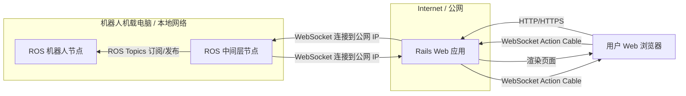
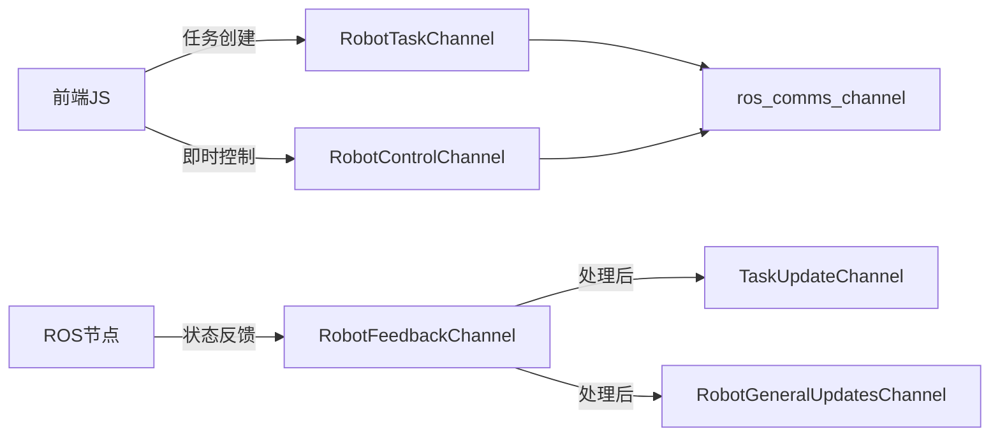
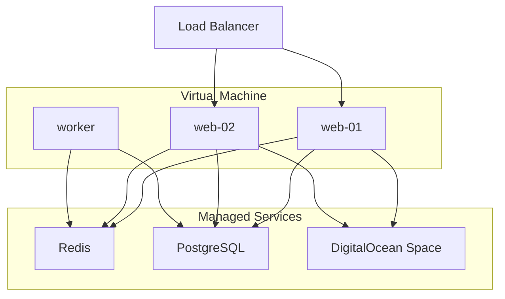

# 图书馆机器人控制系统

## 项目概述

本项目是一个使用 Ruby on Rails 构建的 Web 应用，作为控制 ROS Noetic 机器人的前端界面。项目为机器人相关课程设计，旨在提供一个用户友好的界面来管理图书馆藏资源（书籍、书架、库位）、展示机器人状态，控制机器人执行导航建图、书籍取放、书架巡检等任务，并通过 WebSocket 与机器人进行实时通信。

**技术栈：** Rails 7.2.2.1、Tailwind CSS、Stimulus JS、Action Cable、WebSocket、PostgreSQL（生产环境）、SQLite（开发环境）

**开发环境：** WSL2 Ubuntu 22.04

**项目完成度：** 约 90% 🚀



## 系统架构设计

### 核心通信架构



### 部署架构



## 核心功能模块

### 🤖 实时通信与机器人控制

*   **双向通信架构**
    *   Web 前端 (JS) → Rails Channels → ROS `web_robot_bridge` → ROS `task_manager` 的指令下发
    *   ROS `task_manager` → ROS `web_robot_bridge` → Rails Channels → 前端 JS 的状态反馈
    
*   **实时状态监控**
    *   通过 WebSocket 实时展示机器人状态
    *   位置、速度、电量、连接状态、错误信息、当前任务、活动地图
    *   仪表盘界面，带有状态指示器
    
*   **智能控制系统**
    *   基础移动控制（前进、后退、左转、右转、停止）
    *   紧急停止与恢复功能
    *   手动/自动模式切换
    *   实时反馈和状态同步

### 👥 用户认证与权限管理

*   **基于 authentication-zero 的安全认证**
*   **多重认证机制**
    *   机器人客户端通过 `X-Robot-API-Key` 认证
    *   用户浏览器通过 `user_token` 认证
*   **管理员与普通用户权限分离**

### 📚 书籍管理

*   **书籍 CRUD 系统**
*   **Active Storage 封面图片管理** (存储于 DigitalOcean Space)
*   **搜索功能**（书名、作者、ISBN）
*   **状态管理**（在架、借出、异常、中转）
*   **位置关联**（当前位置、预定位置）
*   **机器人操作集成**
    *   实时任务创建和监控
    *   取书到中转站任务
    *   还书到原位置任务

### 🏗️ 书架与空间管理

*   **3D 空间坐标系统**
*   **可视化书架布局**
*   **智能库位管理**
    *   自动生成多层级库位
    *   可视化占用状态
    *   支持中转站概念
*   **交互式位置分配**
    *   模态框位置分配界面
    *   实时库位可用性检查

### 🎯 任务管理与调度

*   **多类型任务支持**
    - [x] 自动建图 (`map_build_auto`)
    - [x] 地图加载 (`load_map`)
    - [x] 导航到指定点 (`navigation_to_point`)
    - [x] 取书到中转站 (`fetch_book_to_transfer`)
    - [ ] 从中转站归还书籍 (`return_book_from_transfer`)
    - [ ] 库存扫描与重定位 (`inventory_scan_and_relocate`)

*   **任务调度**
    *   任务优先队列管理
    *   实时进度追踪
    *   状态自动更新

*   **任务生命周期**
    *   创建 → 排队 → 处理中 → 完成/失败/取消
    *   实时 WebSocket 状态同步
    *   详细的任务日志记录

### 🗺️ 地图管理

*   **地图文件管理**
    *   地图创建、编辑、删除
    *   Active Storage 地图文件存储 (DigitalOcean Space)
    *   自动建图任务集成
    
*   **导航系统**
    *   活动地图管理
    *   书架导航集成

### 📊 系统日志

*   **系统日志**
    *   分类日志（系统、机器人、用户、任务、错误）
    *   严重程度分级
    *   实时日志记录
    
## 🎨 用户界面特色

### 现代化设计语言
*   **响应式设计**：完美适配桌面、平板、手机
*   **渐变配色**：专业的蓝色渐变主题
*   **流畅动画**：状态变化动画和过渡效果
*   **直观图标**：内联 SVG 图标，无外部依赖

### 实时交互体验
*   **WebSocket 实时更新**：所有状态变化即时反映
*   **智能通知系统**：成功/错误/警告消息
*   **进度可视化**：任务进度条和状态指示器
*   **快速操作面板**：一键执行常用操作

### 专业控制界面
*   **机器人控制台**：专业级机器人操作界面
*   **任务监控中心**：实时任务状态和进度监控
*   **书架可视化**：3D 书架布局和占用状态
*   **智能搜索**：全文搜索和高级筛选

## 当前完成状态

### 已完成功能

#### 核心架构
*   ✅ Rails + ROS 双向通信架构
*   ✅ WebSocket 实时通信
*   ✅ Docker 容器化部署
*   ✅ 基础云部署配置

#### 后端系统
*   ✅ Action Cable Channels 实现
*   ✅ 数据模型设计和实现
*   ✅ 业务逻辑和验证规则
*   ✅ 系统日志

#### 前端界面
*   ✅ 响应式 UI 设计
*   ✅ 状态监控仪表盘
*   ✅ 书籍管理界面
*   ✅ 书架管理和可视化
*   ✅ 任务创建和监控界面
*   ✅ 机器人控制面板
*   ✅ 用户认证和权限管理

#### 机器人集成
*   ✅ ROS 节点通信接口
*   ✅ 任务调度和执行
*   ✅ 状态反馈和监控
*   ✅ 地图管理集成

#### 用户体验
*   ✅ 直观的操作流程
*   ✅ 实时反馈和通知
*   ✅ 错误处理和恢复
*   ✅ 多语言支持（中文/英文）

#### 待完善功能
*   🔄 书架巡检功能（部分未完成）
*   🔄 高级可视化功能
*   🔄 性能优化（部分未完成）
*   🔄 实机测试和调试（部分未完成）

## 技术特点

### 架构设计
*   **清晰的服务边界**：前端、Rails 后端、ROS 机器人端分离
*   **事件驱动**：基于 WebSocket 的实时事件系统
*   **状态机模式**：任务和机器人状态管理

### 实时通信
*   **Action Cable 频道**：多频道实时通信
*   **WebSocket 连接**：低延迟双向通信
*   **状态同步**：实时状态更新

### 安全性
*   **多层认证**：用户认证 + API 密钥
*   **权限控制**：基于角色的访问控制
*   **数据验证**：前后端双重验证
*   **安全通信**：HTTPS + WSS 加密传输

### 可维护性
*   **代码组织**：清晰的 MVC 架构
*   **测试覆盖**：单元测试和集成测试
*   **文档完整**：代码注释和 API 文档
*   **国际化**：完整的多语言支持

### 存储方案
*   **DigitalOcean Space**：用于 Active Storage 文件存储
*   **PostgreSQL**：主数据库
*   **Redis**：缓存和 Action Cable 适配器

## 部署和运行

### 使用 Docker（推荐）

**前提条件：**
*   Docker & Docker Compose

**步骤：**

1. **克隆仓库**
    ```bash
    git clone <仓库地址>
    cd <项目目录>
    ```

2. **环境变量**

    ```bash
    # .env
    REDIS_URL=redis://redis:6379/1
    ROBOT_API_KEY=your_api_key_here

    # config/storage.yml
    DO_SPACES_ACCESS_KEY_ID=your_access_key
    DO_SPACES_SECRET_ACCESS_KEY=your_secret_key
    DO_SPACES_ENDPOINT=https://nyc3.digitaloceanspaces.com # 根据实际地区选择
    DO_SPACES_BUCKET=your_bucket_name
    # 或者修改config.active_storage.service为local，使用本地存储
    ```

3. **构建并启动**
    ```bash
    docker compose build
    docker compose up
    docker compose exec web /bin/bash # 进行数据库初始化
    bin/rails db:migrate
    bin/rails db:seed
    ```

4. **访问应用**
    ```
    http://localhost:3000
    ```

### 本地开发环境

**前提条件：**
*   Ruby 3.3.4
*   Node.js LTS
*   Redis
*   PostgreSQL（生产环境）

**步骤：**

1.  **环境配置**
    ```bash
    bundle install
    yarn install
    ```

2.  **环境变量**
    
    ```bash
    # .env
    REDIS_URL=redis://redis:6379/1
    ROBOT_API_KEY=your_api_key_here

    # config/storage.yml
    DO_SPACES_ACCESS_KEY_ID=your_access_key
    DO_SPACES_SECRET_ACCESS_KEY=your_secret_key
    DO_SPACES_ENDPOINT=https://nyc3.digitaloceanspaces.com # 根据实际地区选择
    DO_SPACES_BUCKET=your_bucket_name
    # 或者修改config.active_storage.service为local，使用本地存储
    ```
    
3.  **数据库初始化**
    
    ```bash
    bin/rails db:migrate
    bin/rails db:seed # 可自行设置初始化数据
    ```

4.  **启动开发服务器**
    ```bash
    bin/dev
    ```

### ROS 节点集成测试

**前提条件：**
*   ROS Noetic 环境
*   Python websocket-client

**步骤：**

1.  **配置 WebSocket 连接**
    ```python
    # library_robot_interfaces/web_robot_bridge_node.py
    WEBSOCKET_URL = "ws://localhost:3000/cable"
    ```

2.  **启动 ROS 节点**
    ```bash
    source /opt/ros/noetic/setup.bash
    source ~/catkin_ws/devel/setup.bash
    roslaunch library_robot_interfaces robot_bridge_system.launch
    ```

3.  **验证通信**
    *   Web 界面显示"ROS通信正常"和"在线"状态
    *   机器人状态实时更新
    *   控制指令正常响应

## 课程项目目标

作为机器人课程的一部分，本项目旨在：

*   ✅ 展示 ROS 与 Web 应用的集成
*   ✅ 实现实时通信和状态监控
*   ✅ 提供直观的机器人控制界面
*   ✅ 演示任务调度和管理
*   ✅ 完整的软件工程实践

项目已基本实现预期功能，可用于课程演示和实际机器人控制测试。
